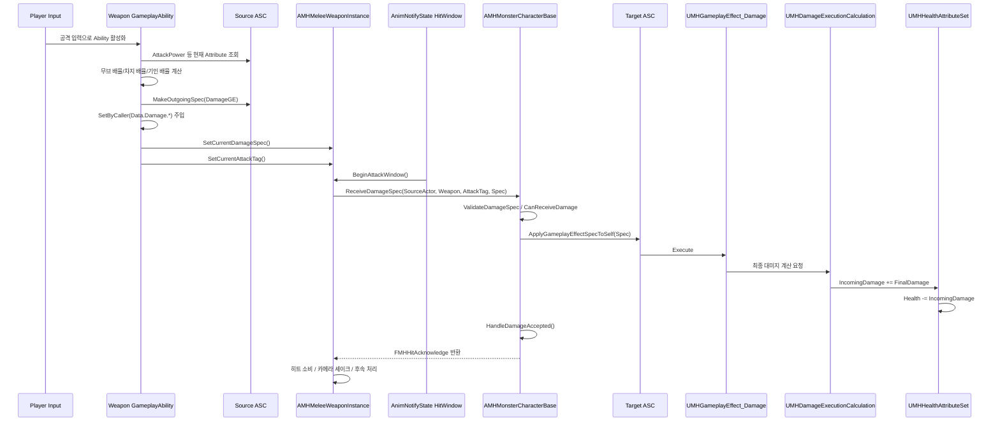
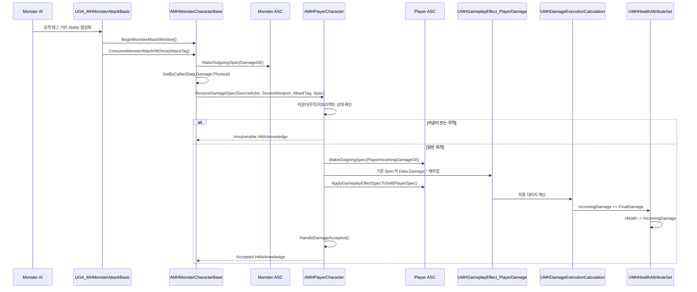
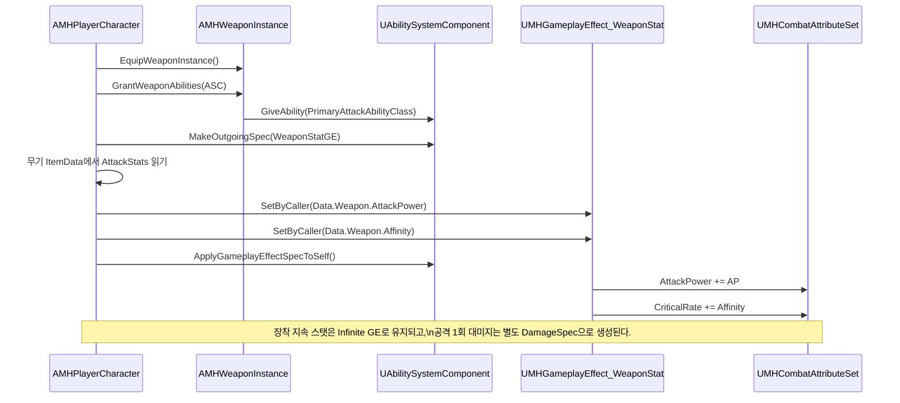

# Damage Delivery System UML

## 1. 클래스 구조

```mermaid
classDiagram
    class AMHCharacterBase {
        +ReceiveDamageSpec()
        +ValidateDamageSpec()
        +CanReceiveDamage()
        +ApplyIncomingDamageSpec()
        +HandleDamageAccepted()
    }

    class AMHPlayerCharacter {
        +ApplyIncomingPlayerDamageSpec()
        +HandleWeaponAttackHit()
        +RefreshEquippedWeaponStatEffect()
    }

    class AMHMonsterCharacterBase {
        +ConsumeMonsterAttackHitOnce()
        +BuildMonsterDamageSpec()
        +HandleDamageAccepted()
    }

    class AMHWeaponInstance {
        +GrantWeaponAbilities()
        +ClearWeaponAbilities()
        +GetAttackStats()
    }

    class AMHMeleeWeaponInstance {
        +BeginAttackWindow()
        +EndAttackWindow()
        +SetCurrentDamageSpec()
        +SetCurrentAttackTag()
        +OnWeaponBeginOverlap()
        +TryDeliverDamageSpecToTarget()
    }

    class UMHGA_LongSwordCombo {
        +BuildDamageSpecForNode()
        +PushDamageSpecToWeapon()
    }

    class UMHGA_GreatSwordAttack {
        +BuildDamageSpecForMove()
        +PushCurrentAttackDataToWeapon()
    }

    class UGA_MHMonsterAttackBasic {
        +ActivateAbility()
        +EndAbility()
    }

    class UAbilitySystemComponent {
        +GiveAbility()
        +MakeOutgoingSpec()
        +ApplyGameplayEffectSpecToSelf()
        +RemoveActiveGameplayEffect()
        +SetNumericAttributeBase()
    }

    class UMHGameplayEffect_Damage {
        +Instant GE
    }

    class UMHGameplayEffect_PlayerDamage {
        +Player 전용 Damage GE 래퍼
    }

    class UMHGameplayEffect_WeaponStat {
        +Infinite GE
        +AttackPower += SetByCaller
        +CriticalRate += SetByCaller
    }

    class UMHDamageExecutionCalculation {
        +Execute()
        +CalculatePhysicalDamage()
        +CalculateElementDamage()
        +ApplyCritical()
    }

    class UMHHealthAttributeSet {
        +Health
        +MaxHealth
        +IncomingDamage
        +PostGameplayEffectExecute()
    }

    class UMHCombatAttributeSet {
        +AttackPower
        +Defense
        +CriticalRate
        +SharpnessModifier
    }

    class UMHResistanceAttributeSet {
        +FireResist
        +WaterResist
        +ThunderResist
        +IceResist
        +DragonResist
    }

    class IMHDamageSpecReceiverInterface {
        +ReceiveDamageSpec()
    }

    AMHPlayerCharacter --|> AMHCharacterBase
    AMHMonsterCharacterBase --|> AMHCharacterBase
    AMHCharacterBase ..|> IMHDamageSpecReceiverInterface

    AMHPlayerCharacter --> UAbilitySystemComponent : owns
    AMHMonsterCharacterBase --> UAbilitySystemComponent : owns
    AMHPlayerCharacter --> UMHHealthAttributeSet : owns
    AMHPlayerCharacter --> UMHCombatAttributeSet : owns
    AMHPlayerCharacter --> UMHResistanceAttributeSet : owns
    AMHMonsterCharacterBase --> UMHHealthAttributeSet : owns
    AMHMonsterCharacterBase --> UMHCombatAttributeSet : owns

    AMHMeleeWeaponInstance --|> AMHWeaponInstance
    AMHPlayerCharacter --> AMHWeaponInstance : equips
    AMHMeleeWeaponInstance --> IMHDamageSpecReceiverInterface : deliver spec

    AMHWeaponInstance --> UAbilitySystemComponent : GiveAbility/ClearAbility
    AMHPlayerCharacter --> UMHGameplayEffect_WeaponStat : create/apply
    UMHGameplayEffect_WeaponStat --> UMHCombatAttributeSet : modify

    UMHGA_LongSwordCombo --> UAbilitySystemComponent : read attrs / make spec
    UMHGA_GreatSwordAttack --> UAbilitySystemComponent : read attrs / make spec
    UGA_MHMonsterAttackBasic --> AMHMonsterCharacterBase : open attack window

    UMHGA_LongSwordCombo --> UMHGameplayEffect_Damage : create spec
    UMHGA_GreatSwordAttack --> UMHGameplayEffect_Damage : create spec
    AMHMonsterCharacterBase --> UMHGameplayEffect_Damage : create spec
    AMHPlayerCharacter --> UMHGameplayEffect_PlayerDamage : rewrap incoming spec

    UMHGameplayEffect_PlayerDamage --|> UMHGameplayEffect_Damage
    UMHGameplayEffect_Damage --> UMHDamageExecutionCalculation : execute
    UMHDamageExecutionCalculation --> UMHCombatAttributeSet : capture
    UMHDamageExecutionCalculation --> UMHResistanceAttributeSet : capture
    UMHDamageExecutionCalculation --> UMHHealthAttributeSet : output IncomingDamage
```

## 2. 플레이어가 몬스터를 타격하는 시퀀스

## 3. 몬스터가 플레이어를 타격하는 시퀀스

## 4. 장착 스탯이 ASC로 반영되는 시퀀스

## 5. UML 해석 포인트

- 공격 Ability와 실제 피격 적용은 같은 객체가 아니다.
- `GameplayEffectSpec`은 공격자에서 만들어지지만, 실제 적용 주체는 타깃 ASC다.
- 플레이어는 incoming damage를 한 번 더 재포장하는 별도 레이어를 갖는다.
- 무기 장착 스탯 GE와 공격용 Damage GE는 목적이 다르므로 분리되어 있다.
