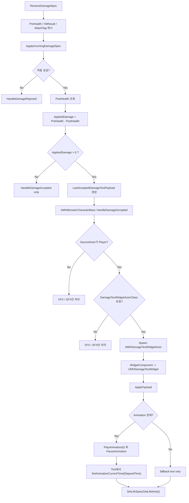
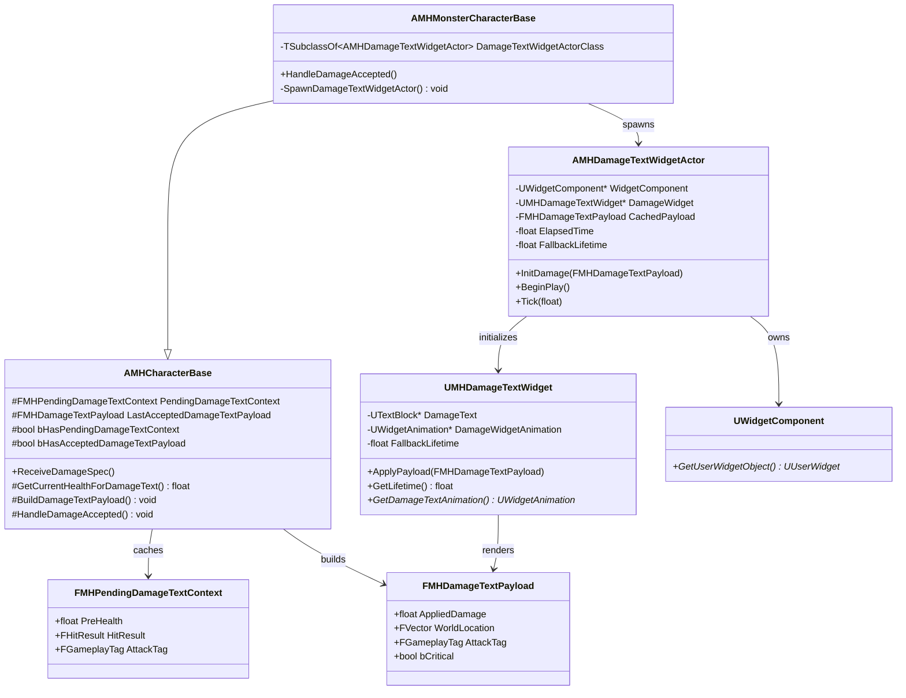

# Damage Text Widget 설계 문서

## 1. 목적

`ReceiveDamageSpec -> ApplyIncomingDamageSpec -> HandleDamageAccepted` 흐름에 맞춰,

- 실제로 적용된 대미지 수치를 확정하고
- 맞은 위치에 대미지 텍스트를 띄우며
- `AMHDamageTextWidgetActor`, `UMHDamageTextWidget`의 책임을 명확히 나누는 구조를 정의한다.

이 문서는 현재 코드베이스를 기준으로 "어디에서 수치를 구하고", "어디에서 스폰하며", "위젯과 액터가 각각 무엇을 해야 하는지"를 정리한 기획 문서다.

## 2. 현재 코드 흐름 분석

### 2.1 공통 수신 흐름

기본 수신 파이프라인은 `AMHCharacterBase::ReceiveDamageSpec_Implementation()`에 있다.

1. `ValidateDamageSpec()`
2. `CanReceiveDamage()`
3. `ApplyIncomingDamageSpec()`
4. `HandleDamageAccepted()`
5. `IsDead()` / `HandleDeath()`

관련 코드:

- `Source/ProjectMHW/Private/Character/MHCharacterBase.cpp`
- `Source/ProjectMHW/Public/Character/MHCharacterBase.h`

### 2.2 플레이어 특이점

`AMHPlayerCharacter`는 수신 직전 카운터/무적 판정을 먼저 처리하고, 일반 피격이면 `Super::ReceiveDamageSpec_Implementation()`으로 내려간다.

또한 `ApplyIncomingDamageSpec()`를 override 해서, 전달받은 `DamageSpec`을 그대로 적용하지 않고 `PlayerIncomingDamageEffectClass` 기반 spec으로 재포장한 뒤 자기 ASC에 적용한다.

즉, 플레이어는 "수신 조건"과 "적용 방식"만 특수하고, 최종적으로는 동일한 Health Attribute가 감소한다.

관련 코드:

- `Source/ProjectMHW/Private/Character/Player/MHPlayerCharacter.cpp`

### 2.3 몬스터 특이점

`AMHMonsterCharacterBase`는 `ReceiveDamageSpec_Implementation()`를 별도로 다시 구현하고 있다.

- `HasDeadTag()` 선확인
- `CanReceiveDamage()` 확인
- `TargetASC->ApplyGameplayEffectSpecToSelf()`
- `HandleDamageAccepted()`
- `IsMonsterDead()` / `HandleDeath()`

즉, 현재 몬스터는 베이스 수신 흐름을 재사용하지 않고 거의 같은 로직을 복제한 상태다.

이 점은 이후 대미지 텍스트 연동 시 중요하다. 베이스에 공통 로직을 넣어도 몬스터 override를 같이 수정하지 않으면 동작이 분리된다.

관련 코드:

- `Source/ProjectMHW/Private/Character/Monster/MHMonsterCharacterBase.cpp`

### 2.4 최종 대미지 수치가 확정되는 지점

실제 최종 대미지는 `HandleDamageAccepted()`에서 계산되지 않는다.

최종 수치 확정은 아래 두 단계에서 일어난다.

1. `UMHDamageExecutionCalculation::Execute_Implementation()`
   - `SetByCaller(Data.Damage.*)`를 읽고
   - 방어력/속성저항/예리도/크리티컬을 반영해
   - `IncomingDamage` 출력 modifier를 만든다.
2. `UMHHealthAttributeSet::PostGameplayEffectExecute()`
   - `IncomingDamage`를 읽고
   - 실제 `Health -= Damage`를 적용한다.

즉, `HandleDamageAccepted()`는 "피격 위치"는 알고 있지만 "실제로 얼마가 깎였는지"는 인자로 전달받지 못한다.

관련 코드:

- `Source/ProjectMHW/Private/Combat/Execution/MHDamageExecutionCalculation.cpp`
- `Source/ProjectMHW/Private/Combat/Attributes/MHHealthAttributeSet.cpp`

## 3. 핵심 설계 판단

### 3.1 결론

대미지 텍스트용 수치는 `HandleDamageAccepted()`에서 직접 계산하지 말고, `DamageSpec` 적용 전후의 Health delta로 확정하는 구조를 권장한다.

권장 이유:

- 현재 코드베이스를 가장 적게 건드린다.
- 플레이어의 "Damage GE 재포장" 흐름에도 그대로 적용된다.
- Execution / AttributeSet / GameplayEffectContext를 추가 확장하지 않아도 된다.
- "실제로 깎인 값"을 구하므로 clamp 결과까지 반영된다.

### 3.2 권장 계산식

`AppliedDamage = max(0, PreHealth - PostHealth)`

여기서 `PreHealth`, `PostHealth`는 캐릭터의 `ASC`에서 `UMHHealthAttributeSet::GetHealthAttribute()`를 읽어 구한다.

즉, 베이스 캐릭터에서도 Health AttributeSet 포인터를 직접 들고 있을 필요가 없다.

예시 개념:

```cpp
float AMHCharacterBase::GetCurrentHealthForDamageText() const
{
    const UAbilitySystemComponent* ASC = GetCharacterASC();
    if (!ASC)
    {
        return 0.f;
    }

    return ASC->GetNumericAttribute(UMHHealthAttributeSet::GetHealthAttribute());
}
```

## 4. 권장 구조

### 4.1 역할 분리

`AMHCharacterBase`

- 대미지 적용 공통 흐름 담당
- 피격 위치와 적용 전 HP를 캐시
- 적용 후 HP delta로 실제 대미지 값을 확정
- 마지막 accepted hit 기준 대미지 텍스트 payload 생성

`AMHMonsterCharacterBase`

- 몬스터 피격 시 VFX / SFX / Damage Text 스폰 담당
- 실제 스폰 시점은 `HandleDamageAccepted()`에서 처리
- 현재 확정 범위는 "플레이어가 몬스터를 공격한 경우"에만 대미지 숫자를 띄운다.

`AMHPlayerCharacter`

- 카운터/무적 판정만 특수 처리
- 일반 피격은 베이스 공통 흐름 사용
- 기본값으로는 대미지 텍스트 스폰 비활성 유지 권장

`AMHDamageTextWidgetActor`

- 월드상의 임시 UI 액터
- 위젯 컴포넌트 보유
- payload를 위젯에 전달
- 애니메이션 시간을 소유하고 갱신
- 수명 관리

`UMHDamageTextWidget`

- 숫자 표시 담당
- 입력값 포맷팅
- 애니메이션 참조 제공
- 애니메이션 길이 기반 lifetime 반환

### 4.2 베이스에 둘 데이터

권장 transient 데이터:

```cpp
USTRUCT()
struct FMHDamageTextPayload
{
    GENERATED_BODY()

    float AppliedDamage = 0.f;
    FVector WorldLocation = FVector::ZeroVector;
    FGameplayTag AttackTag;
    bool bCritical = false;
};
```

```cpp
USTRUCT()
struct FMHPendingDamageTextContext
{
    GENERATED_BODY()

    float PreHealth = 0.f;
    FHitResult HitResult;
    FGameplayTag AttackTag;
};
```

`AMHCharacterBase` 권장 멤버:

- `FMHPendingDamageTextContext PendingDamageTextContext`
- `FMHDamageTextPayload LastAcceptedDamageTextPayload`
- `bool bHasPendingDamageTextContext`
- `bool bHasAcceptedDamageTextPayload`

### 4.3 권장 공통 흐름

1. `ReceiveDamageSpec_Implementation()` 진입
2. `PreHealth` 조회
3. `HitResult`, `AttackTag`, `PreHealth` 캐시
4. `ApplyIncomingDamageSpec()`
5. 적용 성공 시 `PostHealth` 조회
6. `AppliedDamage = PreHealth - PostHealth`
7. `AppliedDamage > 0`이면 `LastAcceptedDamageTextPayload` 생성
8. `HandleDamageAccepted()` 호출
9. 몬스터 override에서 payload를 읽어 `AMHDamageTextWidgetActor` 스폰

## 5. 몬스터 쪽 적용 권장안

### 5.1 가장 권장하는 방향

`AMHMonsterCharacterBase::ReceiveDamageSpec_Implementation()`의 중복을 줄이고 베이스를 재사용한다.

권장 형태:

1. `HasDeadTag()`만 몬스터에서 먼저 검사
2. 일반 피격은 `Super::ReceiveDamageSpec_Implementation(...)`
3. 몬스터 사망 판정은 `IsDead()` override 또는 `HandleDeath()` 경로로 정리

이렇게 하면 Damage Text 관련 캐시 로직을 베이스 한 곳에만 두면 된다.

### 5.2 당장 구조를 크게 안 바꾸는 방향

현재 몬스터 override를 유지한다면, 아래 로직을 몬스터 override에도 동일하게 넣어야 한다.

- 적용 전 `PreHealth` 캐시
- 적용 후 `PostHealth` 조회
- `AppliedDamage` 계산
- `LastAcceptedDamageTextPayload` 생성

즉, 베이스만 고치면 끝나는 구조가 아니다.

## 6. Damage Text 스폰 정책

### 6.1 스폰 위치

1순위: `HitResult.ImpactPoint`

2순위 fallback:

- `HitResult.Location`
- `GetActorLocation() + FVector(0, 0, 80.f)`

추가로 시야 가림을 덜 받게 하려면 약간의 Z offset을 더하는 것이 안전하다.

예:

```cpp
SpawnLocation = ImpactPoint + FVector(0.f, 0.f, 20.f);
```

### 6.2 스폰 조건

다음 조건을 모두 만족할 때만 스폰 권장:

- hit accepted
- `AppliedDamage > 0.f`
- `DamageTextWidgetActorClass` 유효
- 월드 유효

추가 확정 사항:

- `AppliedDamage <= 0.f`면 스폰하지 않는다.
- 숫자 표시는 정수 반올림을 사용한다.
- 다중 히트 누적 처리 없이 히트당 1개 액터만 스폰한다.
- 현재 범위는 싱글 플레이 기준이다.
- 대미지 텍스트는 `플레이어 -> 몬스터` 공격에만 스폰한다.

### 6.3 어디서 스폰할 것인가

현재 프로젝트 기준 권장 위치는 `AMHMonsterCharacterBase::HandleDamageAccepted()`다.

이유:

- 이미 몬스터 피격 VFX / SFX가 여기 모여 있다.
- "플레이어가 몬스터를 때렸을 때 숫자를 띄우는" 요구와 가장 잘 맞는다.
- 플레이어 피격 숫자 표시를 나중에 따로 열 수 있다.

추가 조건:

- `SourceActor`가 `AMHPlayerCharacter`인 경우에만 스폰한다.
- 몬스터끼리의 상호 공격, 플레이어 피격, 환경 대미지는 현재 범위에서 제외한다.

## 7. `AMHDamageTextWidgetActor` 설계

### 7.1 책임

- `UWidgetComponent` 생성 및 소유
- `UMHDamageTextWidget` 확보
- payload 전달
- 수명 종료 시 self destroy

### 7.2 권장 멤버

```cpp
UCLASS()
class PROJECTMHW_API AMHDamageTextWidgetActor : public AActor
{
    GENERATED_BODY()

public:
    AMHDamageTextWidgetActor();

    void InitDamage(const FMHDamageTextPayload& InPayload);

protected:
    virtual void BeginPlay() override;

private:
    UPROPERTY(VisibleAnywhere, Category="Components")
    TObjectPtr<UWidgetComponent> WidgetComponent = nullptr;

    UPROPERTY(Transient)
    TObjectPtr<UMHDamageTextWidget> DamageWidget = nullptr;

    UPROPERTY(Transient)
    FMHDamageTextPayload CachedPayload;

    UPROPERTY(EditDefaultsOnly, Category="DamageText")
    float FallbackLifetime = 2.0f;
};
```

### 7.3 구현 포인트

- 생성자
  - `WidgetComponent = CreateDefaultSubobject<UWidgetComponent>(TEXT("WidgetComponent"))`
  - `SetRootComponent(WidgetComponent)`
  - `WidgetComponent->SetDrawAtDesiredSize(true)`
  - `WidgetComponent->SetCollisionEnabled(ECollisionEnabled::NoCollision)`
  - `WidgetComponent->SetGenerateOverlapEvents(false)`

- 위젯 공간
  - 확정안은 `EWidgetSpace::Screen`
  - 화면 밖에서도 애니메이션 시간이 계속 진행되도록 액터가 시간을 소유한다.

- `BeginPlay()`
  - `WidgetComponent->GetUserWidgetObject()`로 `UMHDamageTextWidget` 캐스팅
  - 캐스팅 성공 시 `DamageWidget` 캐싱
  - `DamageWidget->ApplyPayload(CachedPayload)`
  - `DamageWidget->GetDamageTextAnimation()`으로 애니메이션 참조 획득
  - 애니메이션이 있으면 `PlayAnimation(Animation, 0.f, 1)` 호출
  - 직후 `PauseAnimation(Animation)` 호출
  - 애니메이션이 없거나 캐스팅 실패 시에는 fallback 텍스트만 표시한 채 `2.0f` 유지
  - lifetime은 애니메이션 end time 우선, 없으면 `2.0f`
  - `SetLifeSpan(ResolvedLifetime)`

### 7.4 Tick 사용 여부

현재 확정안은 액터 틱 기반 애니메이션 제어다.

확정 흐름:

- 액터가 누적 시간을 소유한다.
- `BeginPlay()`에서 `PlayAnimation(Animation, 0.f, 1)` 후 즉시 `PauseAnimation(Animation)` 한다.
- `Tick()`에서 `SetAnimationCurrentTime(Animation, ElapsedTime)`을 호출한다.
- `RequestRenderUpdate()`는 현재 설계 범위에서 사용하지 않는다.

이유:

- 대미지 텍스트는 동시에 많이 뜰 수 있다.
- `Screen` 스페이스 위젯은 화면 밖일 때 위젯 애니메이션이 멈출 수 있다.
- 이번 정책은 offscreen 중에도 애니메이션 시간이 계속 진행되어야 한다.

즉, 이번 설계에서는 `AMHDamageTextWidgetActor`가 "스폰, 소멸, 애니메이션 시간 제어"를 담당한다.

## 8. `UMHDamageTextWidget` 설계

### 8.1 책임

- 숫자 문자열 세팅
- 필요 시 색상/스타일 변경
- 애니메이션 참조 제공
- lifetime 반환

### 8.2 권장 멤버

```cpp
UCLASS()
class PROJECTMHW_API UMHDamageTextWidget : public UUserWidget
{
    GENERATED_BODY()

public:
    UMHDamageTextWidget(const FObjectInitializer& ObjectInitializer);

    UFUNCTION(BlueprintCallable, Category="DamageText")
    void ApplyPayload(const FMHDamageTextPayload& InPayload);

    UFUNCTION(BlueprintCallable, Category="DamageText")
    float GetLifetime() const;

    UFUNCTION(BlueprintCallable, Category="DamageText")
    UWidgetAnimation* GetDamageTextAnimation() const;

protected:
    UPROPERTY(meta=(BindWidget))
    TObjectPtr<UTextBlock> DamageText = nullptr;

    UPROPERTY(Transient, meta=(BindWidgetAnimOptional))
    TObjectPtr<UWidgetAnimation> DamageWidgetAnimation = nullptr;

    UPROPERTY(EditDefaultsOnly, BlueprintReadOnly, Category="DamageText")
    float FallbackLifetime = 2.0f;
};
```

### 8.3 구현 포인트

- `ApplyPayload()`
  - `AppliedDamage`를 정수 반올림해서 표시
  - 예: `FText::AsNumber(FMath::RoundToInt(InPayload.AppliedDamage))`
  - `DamageText->SetText(...)`
  - 현재는 크리티컬 미지원이므로 색상 분기 없음

- `GetLifetime()`
  - 애니메이션 있으면 `DamageWidgetAnimation->GetEndTime()`
  - 없으면 `FallbackLifetime(=2.0f)`

- `GetDamageTextAnimation()`
  - 액터가 `PlayAnimation -> PauseAnimation -> SetAnimationCurrentTime` 흐름에 사용할 애니메이션을 반환한다.

### 8.4 BP 연동 포인트

이미 `Content/_BP/UI/BP_DamageTextWidget.uasset`가 있으므로, 이 BP를 `UMHDamageTextWidget` 기반으로 정리하는 것이 자연스럽다.

권장 BP 구성:

- `DamageText` TextBlock 바인딩
- `DamageWidgetAnimation` 바인딩
- 폰트/색상/이징은 BP에서 조정

## 9. 추가 확장 포인트

### 9.1 Critical 표시

현재 범위에서는 크리티컬 표시를 지원하지 않는다.

- `FMHDamageTextPayload::bCritical`는 reserve 필드로만 둔다.
- 추후 필요하면 EffectContext 또는 별도 메타데이터 경로를 추가한다.

### 9.2 네트워크

현재 범위는 싱글 플레이 기준이다.

- replicate 고려는 이번 설계 범위에서 제외한다.

### 9.3 Fallback 처리

애니메이션이 없거나 `UMHDamageTextWidget` 캐스팅에 실패하더라도 액터를 즉시 파괴하지 않는다.

- fallback 텍스트만 2초간 표시한다.
- 즉, 애니메이션은 선택 요소이고 텍스트 노출 자체는 유지한다.

## 10. 구현 우선순위

1. `AMHCharacterBase`에 "피격 전/후 HP delta 기반 payload 생성" 추가
2. `AMHMonsterCharacterBase`가 베이스 공통 흐름을 재사용하도록 정리하거나, 최소한 동일 캐시 로직 반영
3. `AMHDamageTextWidgetActor`에 `UWidgetComponent`, payload 초기화, `PlayAnimation -> PauseAnimation`, `Tick + SetAnimationCurrentTime`, `SetLifeSpan()` 추가
4. `UMHDamageTextWidget`에 `ApplyPayload()`, `GetLifetime()`, `GetDamageTextAnimation()` 추가
5. `BP_DamageTextWidget`에서 텍스트/애니메이션 바인딩 정리

## 11. UML

### 11.1 Sequence Diagram

```mermaid
sequenceDiagram
    participant Weapon as AMHMeleeWeaponInstance
    participant Target as AMHCharacterBase
    participant Player as AMHPlayerCharacter
    participant Monster as AMHMonsterCharacterBase
    participant ASC as UAbilitySystemComponent
    participant Exec as UMHDamageExecutionCalculation
    participant Health as UMHHealthAttributeSet
    participant Actor as AMHDamageTextWidgetActor
    participant Widget as UMHDamageTextWidget

    Weapon->>Target: ReceiveDamageSpec(SourceActor, SourceWeapon, AttackTag, Spec, HitResult)
    Target->>Target: ValidateDamageSpec / CanReceiveDamage
    Target->>Target: Cache PreHealth + HitResult + AttackTag

    alt Player target
        Target->>Player: ApplyIncomingDamageSpec override
        Player->>ASC: Apply player damage GE spec
    else Monster or base target
        Target->>ASC: Apply incoming damage spec
    end

    ASC->>Exec: Execute_Implementation()
    Exec-->>Health: Add IncomingDamage
    Health->>Health: PostGameplayEffectExecute()
    Health->>Health: Health -= IncomingDamage

    Target->>Target: PostHealth read
    Target->>Target: AppliedDamage = PreHealth - PostHealth
    Target->>Target: Build LastAcceptedDamageTextPayload

    Target->>Monster: HandleDamageAccepted(...)
    Monster->>Monster: SourceActor가 Player인지 확인
    Monster->>Actor: SpawnActor at HitResult.ImpactPoint
    Monster->>Actor: InitDamage(Payload)
    Actor->>Widget: ApplyPayload(Payload)
    Actor->>Widget: GetDamageTextAnimation()
    alt Animation exists
        Actor->>Widget: PlayAnimation(0.0)
        Actor->>Widget: PauseAnimation()
        loop Every Tick
            Actor->>Widget: SetAnimationCurrentTime(ElapsedTime)
        end
    else No animation or cast failed
        Actor->>Actor: fallback text only
    end
    Actor->>Actor: SetLifeSpan(GetLifetime())
```

### 11.2 Damage Text Spawn Flow



### 11.3 Class Diagram



## 12. 최종 권장 정리

현재 코드 기준 핵심은 두 가지다.

1. `HandleDamageAccepted()`는 위치는 알고 있지만 최종 대미지 수치는 모른다.
2. 따라서 대미지 텍스트 값은 "DamageSpec 적용 전후 Health delta"로 확정하는 것이 가장 안전하다.

그리고 확정된 UI 클래스 책임은 아래와 같다.

- `AMHDamageTextWidgetActor`: 스폰, payload 전달, 애니메이션 시간 제어, 수명 관리
- `UMHDamageTextWidget`: 숫자 표기, 애니메이션 참조 제공, lifetime 제공

즉, 이번 확정안의 중심은 "최종 대미지 수치를 HP delta로 확정하고, Screen space 오프스크린 정지 문제는 액터 틱으로 우회하며, 플레이어가 몬스터를 공격한 경우에만 대미지 텍스트를 띄운다"이다.
