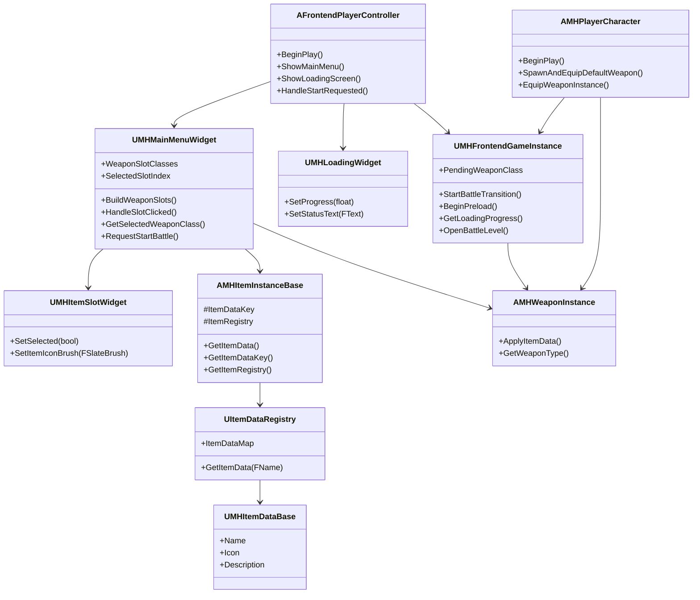
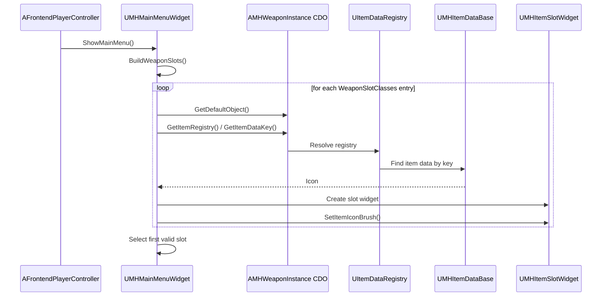
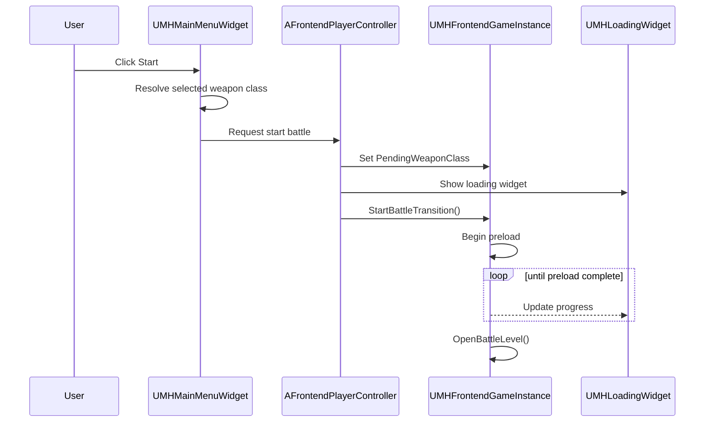
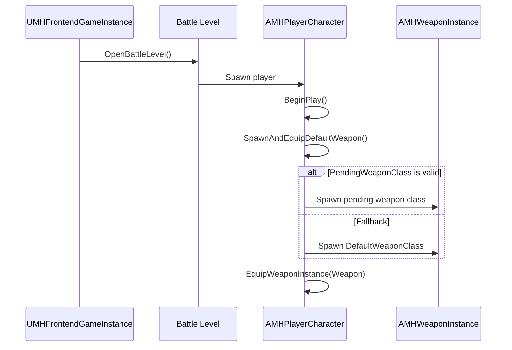
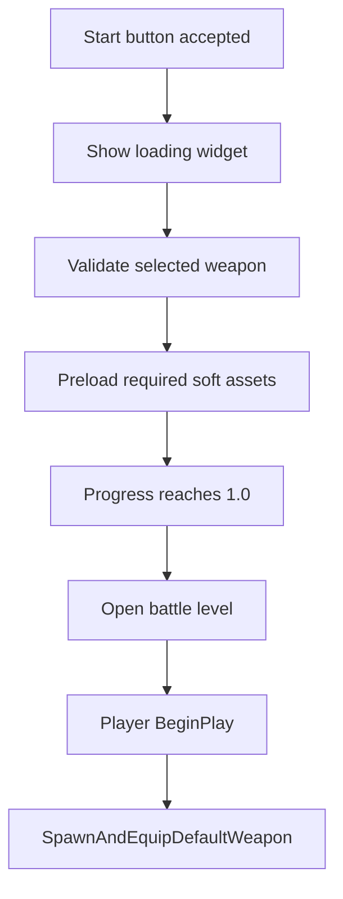

# Frontend Menu and Loading UML

## Class View

## Menu Build Sequence

## Start Transition Sequence

## Battle Entry Sequence

## Loading Progress State

## Notes
- The main menu reuses `UMHItemSlotWidget` instead of inventing a separate slot control.
- Icon resolution depends on adding safe preview accessors to `AMHItemInstanceBase`.
- The loading bar should represent staged preload progress, not the opaque internal map load percent.
- `AMHPlayerCharacter` should keep the existing equip pipeline and only change the class resolution priority.
