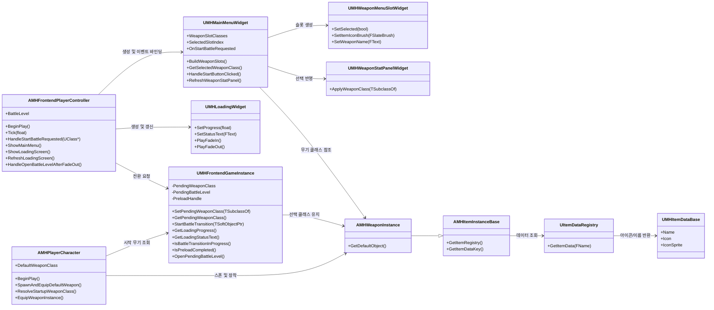
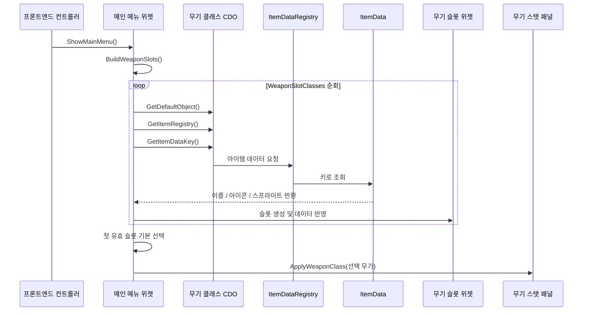
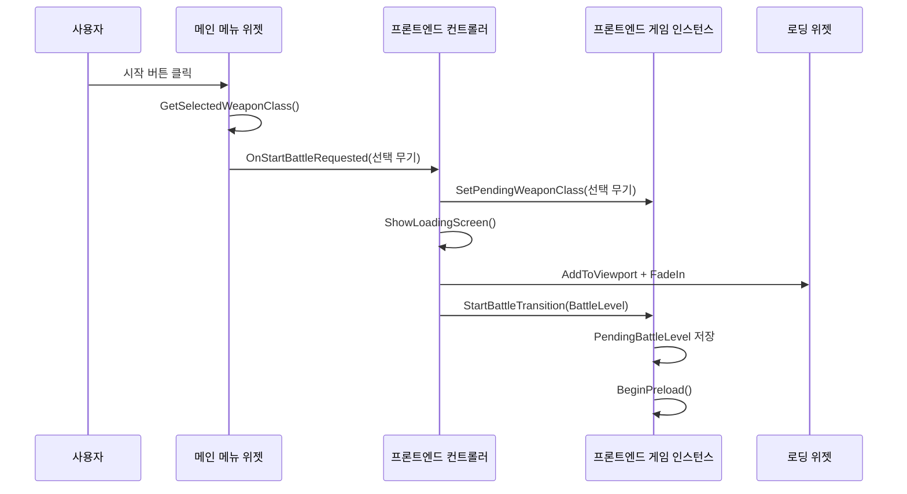
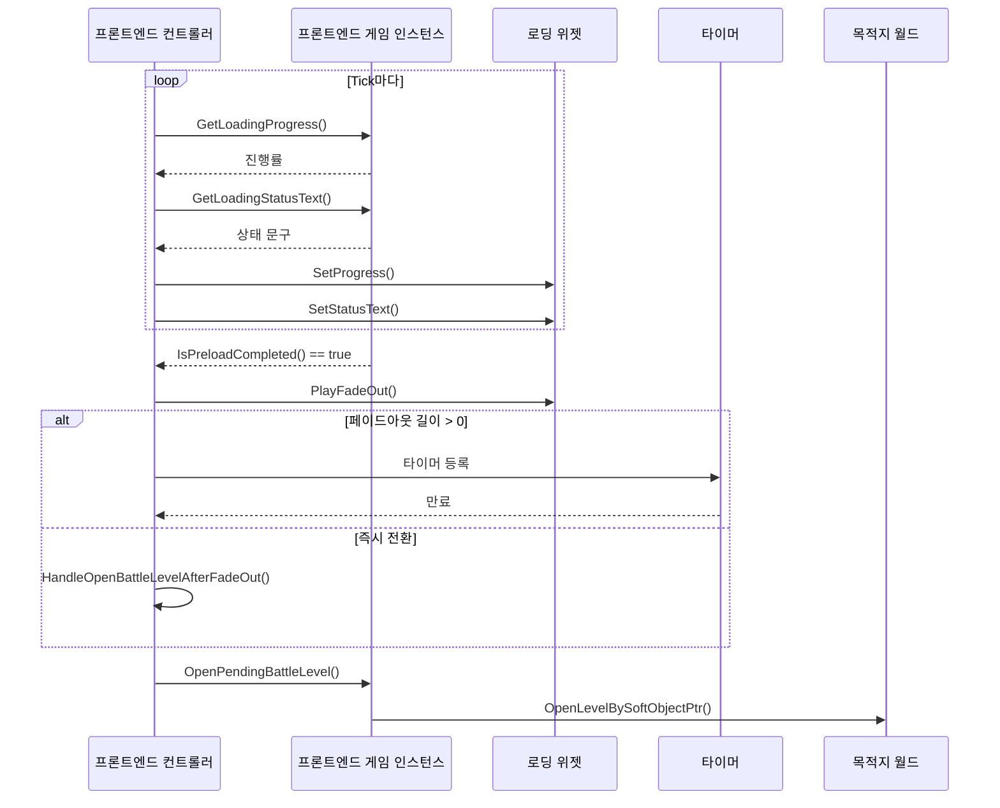
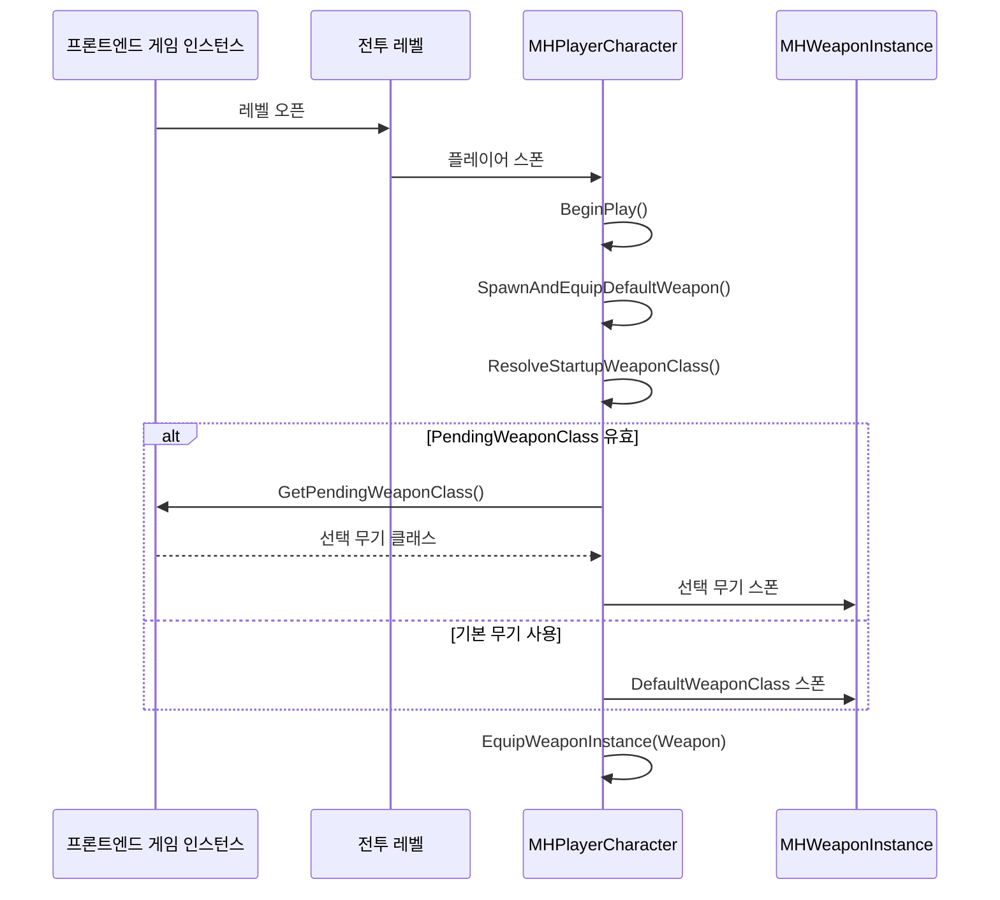
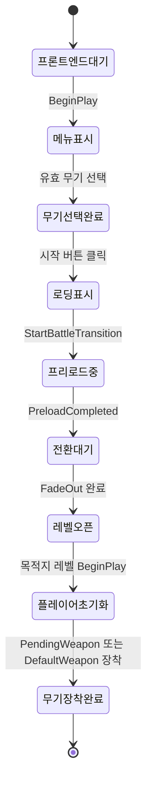
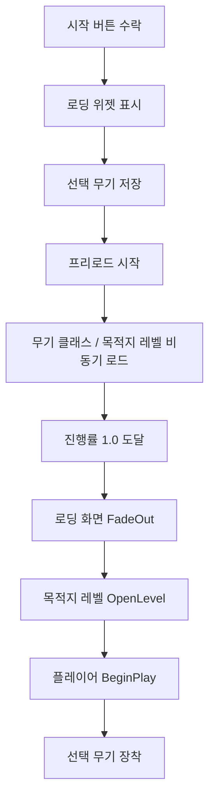

# 프론트엔드 메뉴 → 로딩 → 전투 레벨 진입 UML

## 클래스 다이어그램

## 메뉴 구성 시퀀스

## 전환 시작 시퀀스

## 로딩 갱신 및 레벨 오픈 시퀀스

## 전투 시작 시 무기 적용 시퀀스

## 상태 흐름도

## 진행률 흐름도

## 설계 메모
- 메뉴 위젯은 전환 정책을 모르는 상태로 유지되고, 선택 결과만 외부에 전달한다.
- 로딩 위젯은 표시 전용이며, 로딩 상태 계산 책임은 `UMHFrontendGameInstance`에 있다.
- `AMHPlayerCharacter`는 기존 장착 파이프라인을 유지하고 시작 무기 결정 우선순위만 프론트엔드 상태를 읽도록 확장한다.
- 현재 구조는 "전환 오버레이"에 가깝고, 별도 스트리밍 로딩 맵 구조는 아니다.
