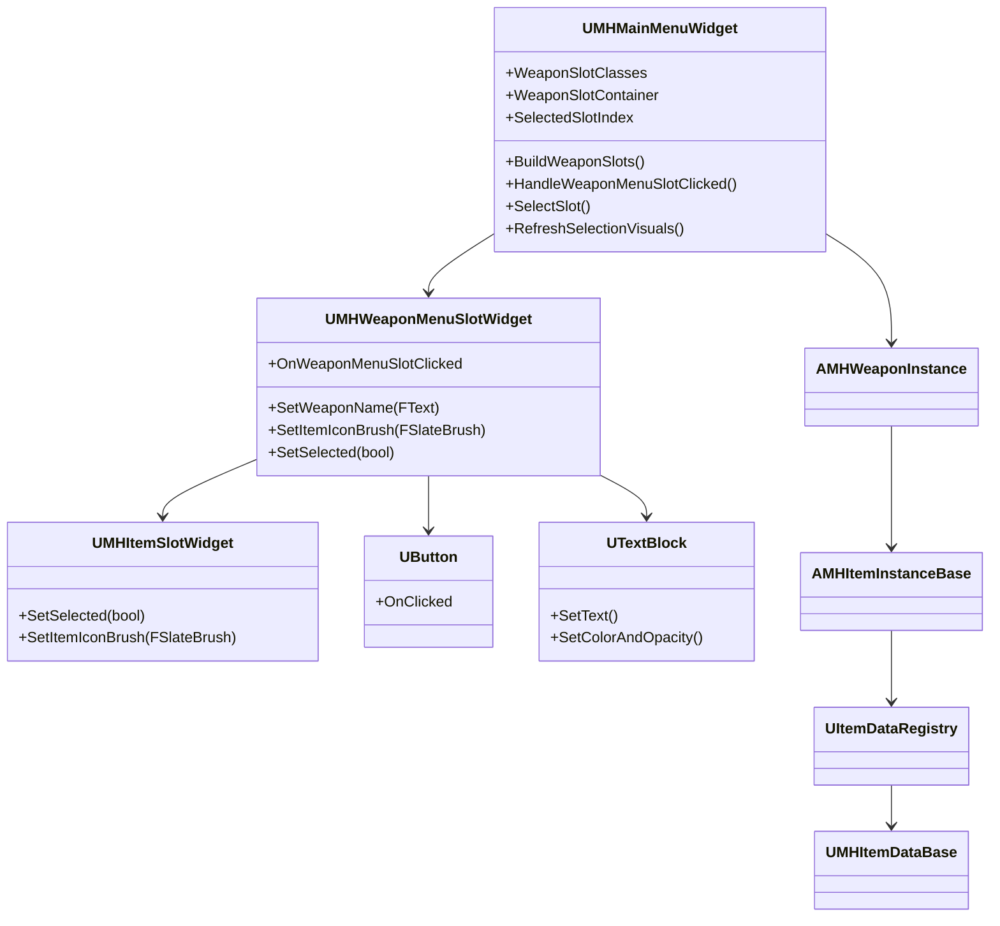
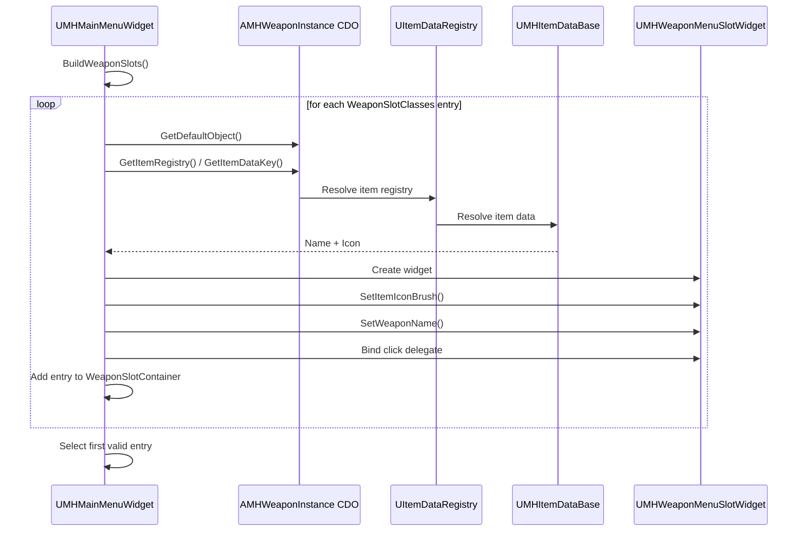
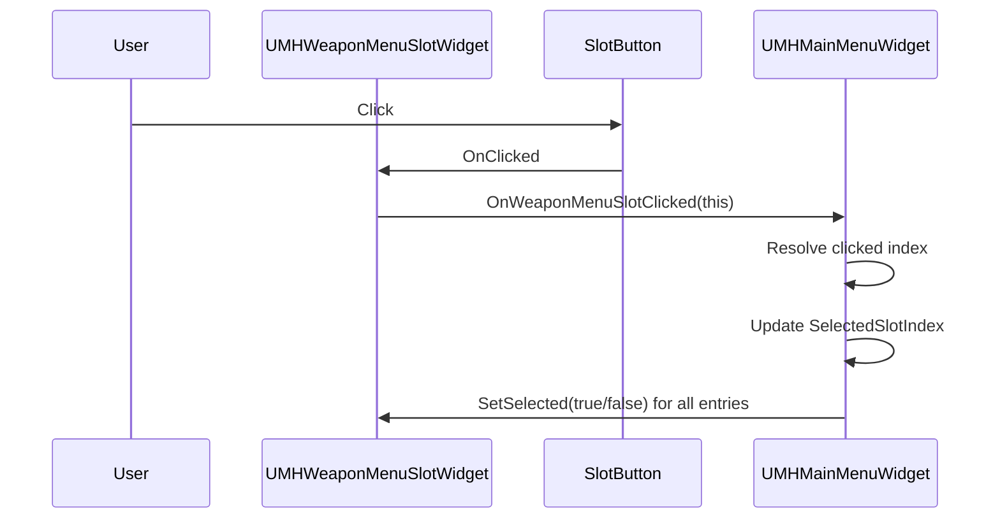
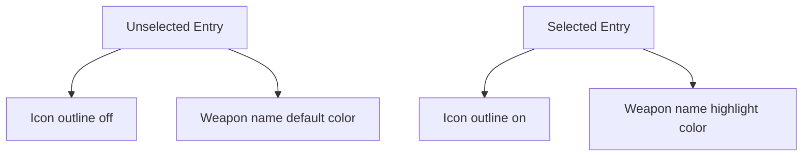

# Frontend Weapon Menu Slot UML

## Class View

```mermaid
classDiagram
    class UMHMainMenuWidget {
        +WeaponSlotClasses
        +WeaponSlotContainer
        +SelectedSlotIndex
        +BuildWeaponSlots()
        +HandleWeaponMenuSlotClicked()
        +SelectSlot()
        +RefreshSelectionVisuals()
    }

    class UMHWeaponMenuSlotWidget {
        +SetWeaponName(FText)
        +SetItemIconBrush(FSlateBrush)
        +SetSelected(bool)
        +OnWeaponMenuSlotClicked
    }

    class UMHItemSlotWidget {
        +SetSelected(bool)
        +SetItemIconBrush(FSlateBrush)
    }

    class UButton {
        +OnClicked
    }

    class UTextBlock {
        +SetText()
        +SetColorAndOpacity()
    }

    class AMHWeaponInstance
    class AMHItemInstanceBase
    class UItemDataRegistry
    class UMHItemDataBase

    UMHMainMenuWidget --> UMHWeaponMenuSlotWidget
    UMHWeaponMenuSlotWidget --> UMHItemSlotWidget
    UMHWeaponMenuSlotWidget --> UButton
    UMHWeaponMenuSlotWidget --> UTextBlock
    UMHMainMenuWidget --> AMHWeaponInstance
    AMHWeaponInstance --> AMHItemInstanceBase
    AMHItemInstanceBase --> UItemDataRegistry
    UItemDataRegistry --> UMHItemDataBase
```

## Build Sequence

```mermaid
sequenceDiagram
    participant Menu as UMHMainMenuWidget
    participant WeaponCDO as AMHWeaponInstance CDO
    participant Registry as UItemDataRegistry
    participant Data as UMHItemDataBase
    participant Entry as UMHWeaponMenuSlotWidget

    Menu->>Menu: BuildWeaponSlots()
    loop for each WeaponSlotClasses entry
        Menu->>WeaponCDO: GetDefaultObject()
        Menu->>WeaponCDO: GetItemRegistry() / GetItemDataKey()
        WeaponCDO->>Registry: Resolve item registry
        Registry->>Data: Resolve item data
        Data-->>Menu: Name + Icon
        Menu->>Entry: Create widget
        Menu->>Entry: SetItemIconBrush()
        Menu->>Entry: SetWeaponName()
        Menu->>Entry: Bind click delegate
        Menu->>Menu: Add entry to WeaponSlotContainer
    end
    Menu->>Menu: Select first valid entry
```

## Click Sequence

```mermaid
sequenceDiagram
    participant User
    participant Entry as UMHWeaponMenuSlotWidget
    participant Button as SlotButton
    participant Menu as UMHMainMenuWidget

    User->>Button: Click
    Button->>Entry: OnClicked
    Entry->>Menu: OnWeaponMenuSlotClicked(this)
    Menu->>Menu: Resolve clicked index
    Menu->>Menu: Update SelectedSlotIndex
    Menu->>Entry: SetSelected(true/false) for all entries
```

## Visual State Flow

```mermaid
flowchart TD
    A["Unselected Entry"] --> B["Icon outline off"]
    A --> C["Weapon name default color"]
    D["Selected Entry"] --> E["Icon outline on"]
    D --> F["Weapon name highlight color"]
```
