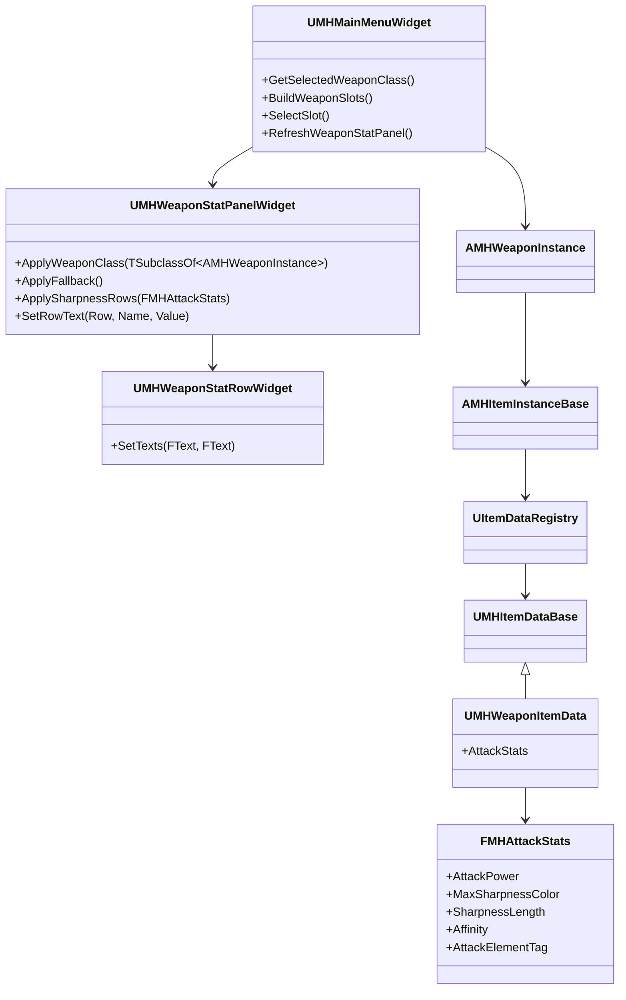
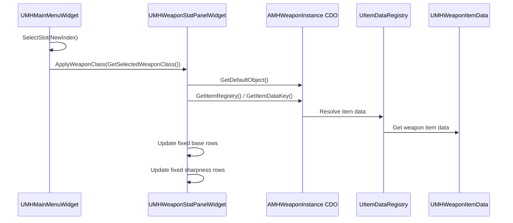
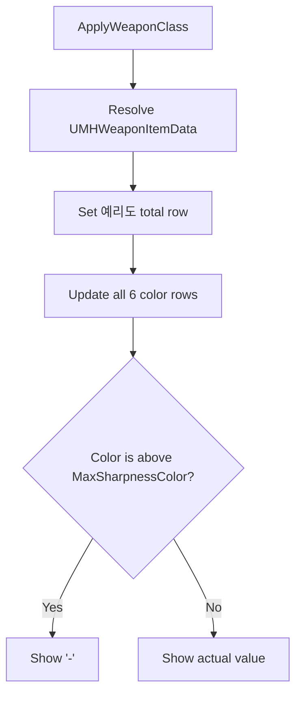

# Frontend Weapon Stat Panel UML

## Class View

```mermaid
classDiagram
    class UMHMainMenuWidget {
        +GetSelectedWeaponClass()
        +BuildWeaponSlots()
        +SelectSlot()
        +RefreshWeaponStatPanel()
    }

    class UMHWeaponStatPanelWidget {
        +ApplyWeaponClass(TSubclassOf~AMHWeaponInstance~)
        +ApplyFallback()
        +ApplySharpnessRows(FMHAttackStats)
        +SetRowText(Row, Name, Value)
    }

    class UMHWeaponStatRowWidget {
        +SetTexts(FText, FText)
    }

    class AMHWeaponInstance
    class AMHItemInstanceBase
    class UItemDataRegistry
    class UMHItemDataBase
    class UMHWeaponItemData {
        +AttackStats
    }

    class FMHAttackStats {
        +AttackPower
        +MaxSharpnessColor
        +SharpnessLength
        +Affinity
        +AttackElementTag
    }

    UMHMainMenuWidget --> UMHWeaponStatPanelWidget
    UMHWeaponStatPanelWidget --> UMHWeaponStatRowWidget
    UMHMainMenuWidget --> AMHWeaponInstance
    AMHWeaponInstance --> AMHItemInstanceBase
    AMHItemInstanceBase --> UItemDataRegistry
    UItemDataRegistry --> UMHItemDataBase
    UMHItemDataBase <|-- UMHWeaponItemData
    UMHWeaponItemData --> FMHAttackStats
```

## Selection Refresh Sequence

```mermaid
sequenceDiagram
    participant Menu as UMHMainMenuWidget
    participant Panel as UMHWeaponStatPanelWidget
    participant WeaponCDO as AMHWeaponInstance CDO
    participant Registry as UItemDataRegistry
    participant Data as UMHWeaponItemData

    Menu->>Menu: SelectSlot(NewIndex)
    Menu->>Panel: ApplyWeaponClass(GetSelectedWeaponClass())
    Panel->>WeaponCDO: GetDefaultObject()
    Panel->>WeaponCDO: GetItemRegistry() / GetItemDataKey()
    WeaponCDO->>Registry: Resolve item data
    Registry->>Data: Get weapon item data
    Panel->>Panel: Update fixed base rows
    Panel->>Panel: Update fixed sharpness rows
```

## Sharpness Build Flow

```mermaid
flowchart TD
    A["ApplyWeaponClass"] --> B["Resolve UMHWeaponItemData"]
    B --> C["Set 예리도 total row"]
    C --> D["Update all 6 color rows"]
    D --> E{"Color is above MaxSharpnessColor?"}
    E -->|Yes| F["Show '-'"]
    E -->|No| G["Show actual value"]
```
