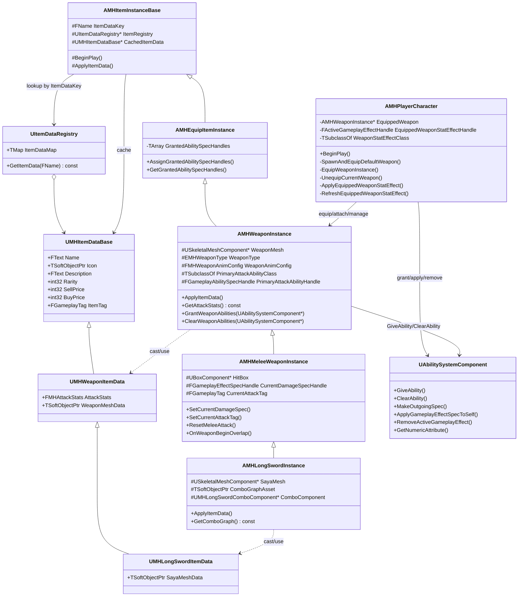
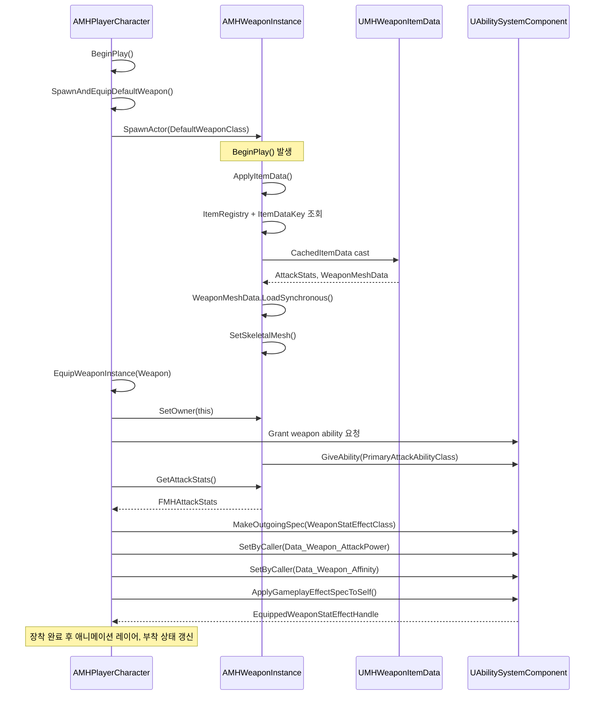

# ItemData -> ItemInstance 자동 적용 구조 분석

## 1. 시스템 개요

### 1.1 현재 구조 요약

이 프로젝트의 아이템 적용 구조는 `ItemData -> ItemInstance`와 `ItemInstance -> Character/GAS`의 2단계로 나뉜다.

1. `UMHItemDataBase` 계열 데이터는 `PrimaryDataAsset`이 아니라 `UObject` 기반이며, `UItemDataRegistry : UDataAsset` 내부의 `Instanced TMap<FName, UMHItemDataBase*>`에 저장된다.
2. 각 `AMHItemInstanceBase`는 `ItemRegistry`와 `ItemDataKey`를 가지고 있으며, `BeginPlay()`에서 `ApplyItemData()`를 호출해 `CachedItemData`를 채운다.
3. `AMHWeaponInstance`/`AMHLongSwordInstance`는 `ApplyItemData()` 오버라이드로 메시를 로드하여 자신의 컴포넌트에 반영한다.
4. 장착 시점의 GAS 반영은 `ItemInstance`가 직접 수행하지 않고, `AMHPlayerCharacter::EquipWeaponInstance()`가 주도한다.
5. 공격 피해 적용은 다시 `UGameplayAbility`가 `GameplayEffectSpec`를 만들고, 이를 무기 인스턴스에 주입한 뒤, 근접 충돌 시 타겟에게 전달하는 구조다.

### 1.2 자동 적용 시점

| 적용 대상 | 자동 적용 시점 | 실제 호출 주체 | 비고 |
|---|---|---|---|
| `CachedItemData` 캐시 | 인스턴스 `BeginPlay()` | `AMHItemInstanceBase` | 런타임 자동 |
| Weapon/Saya 메시 | `BeginPlay() -> ApplyItemData()` | `AMHWeaponInstance`, `AMHLongSwordInstance` | `LoadSynchronous()` 사용 |
| ItemData 변경 재반영 | 에디터 속성 수정 시 | `AMHItemInstanceBase::PostEditChangeProperty()` | 런타임 자동 아님 |
| 무기 Ability 부여 | 무기 장착 시 | `AMHPlayerCharacter::EquipWeaponInstance()` | ASC에 `GiveAbility` |
| 무기 스탯 GE 적용 | 무기 장착 시 | `AMHPlayerCharacter::RefreshEquippedWeaponStatEffect()` | `SetByCaller` 기반 |
| 전투용 DamageSpec 생성 | 공격 Ability 활성화 시 | `UMHGA_LongSwordCombo` | 장착과 별개 |

### 1.3 설계 성격 분석

현재 구조는 완전한 Data Driven 구조라기보다, "데이터 기반 초기화 + 캐릭터 중심 장착 로직" 구조에 가깝다.

- 데이터 중심 요소
  - 무기 메시, 사야 메시, 공격력, 예리도, 회심, 속성 태그는 모두 `ItemData`에 있다.
  - 무기 스탯 GE는 `SetByCaller`로 값만 주입하는 방식이라 수치 자체는 데이터 중심이다.
- 로직 중심 요소
  - 장착 처리, Ability 부여/회수, GE 적용/제거, 무기 부착은 모두 `AMHPlayerCharacter`가 직접 담당한다.
  - `OnEquipped()` 같은 공통 장착 훅은 현재 코드에 존재하지 않는다.

결론적으로, 데이터는 "무기 내용물"을 정의하고, 실제 적용 순서와 책임은 캐릭터 코드가 통제한다.

---

## 2. 데이터 흐름

## 2.1 1단계: ItemData 생성

### 구조

- 루트 타입: `UMHItemDataBase : UObject`
- 저장소: `UItemDataRegistry : UDataAsset`
- 저장 방식: `TMap<FName, UMHItemDataBase*> ItemDataMap`

### 코드 기반 해석

- `UMHItemDataBase`는 `DefaultToInstanced, EditInlineNew`이므로 개별 `.uasset` 타입으로 독립 관리되는 `PrimaryDataAsset` 패턴이 아니라, 레지스트리 에셋 내부에 인스턴스형 서브오브젝트로 편집되는 구조다.
- 따라서 "아이템 에셋"의 실질 단위는 `MHWeaponItemData.uasset` 같은 개별 애셋이 아니라 `UItemDataRegistry` 내부 엔트리다.

### 호출 주체 / 타이밍 / 전달 방식

| 항목 | 내용 |
|---|---|
| 호출 주체 | 디자이너/에디터 |
| 호출 타이밍 | 에셋 편집 시 |
| 데이터 전달 방식 | `ItemDataKey`로 `UItemDataRegistry::ItemDataMap` 조회 |

## 2.2 2단계: ItemInstance 생성 시점

### 실제 흐름

`AMHPlayerCharacter::BeginPlay()`에서 `SpawnAndEquipDefaultWeapon()`가 호출되고, 여기서 `DefaultWeaponClass`를 `SpawnActor<AMHWeaponInstance>()`로 생성한다.

### 코드 흐름

1. `AMHPlayerCharacter::BeginPlay()`
2. `SpawnAndEquipDefaultWeapon()`
3. `World->SpawnActor<AMHWeaponInstance>(DefaultWeaponClass, SpawnParams)`
4. `EquipWeaponInstance(SpawnedWeapon, true)`

### 호출 주체 / 타이밍 / 전달 방식

| 항목 | 내용 |
|---|---|
| 호출 주체 | `AMHPlayerCharacter` |
| 호출 타이밍 | 캐릭터 `BeginPlay()` 직후 |
| 데이터 전달 방식 | 스폰된 무기 Actor 내부에 미리 설정된 `ItemRegistry`, `ItemDataKey` 사용 |

핵심은 캐릭터가 무기 액터만 스폰하고, `ItemData` 포인터를 직접 넘기지는 않는다는 점이다. 실제 데이터 획득은 무기 액터가 자기 자신의 설정값으로 수행한다.

## 2.3 3단계: ItemData 참조 획득 방식

### 실제 구현

`AMHItemInstanceBase::ApplyItemData()`가 아래 절차로 동작한다.

1. `CachedItemData = nullptr` 초기화
2. `ItemRegistry`와 `ItemDataKey` 유효성 검사
3. `ItemRegistry->ItemDataMap.Find(ItemDataKey)` 조회
4. 조회 성공 시 `CachedItemData = *FoundData`

### 특징

- `UItemDataRegistry::GetItemData()` 함수도 존재하지만, 실제 `AMHItemInstanceBase`는 이를 쓰지 않고 `ItemDataMap.Find()`를 직접 호출한다.
- 데이터 전달은 "직접 참조 전달"이 아니라 "키 기반 조회 후 캐시"다.

### 호출 주체 / 타이밍 / 전달 방식

| 항목 | 내용 |
|---|---|
| 호출 주체 | `AMHItemInstanceBase` |
| 호출 타이밍 | `BeginPlay()` 또는 에디터 속성 수정 시 |
| 데이터 전달 방식 | `ItemRegistry + ItemDataKey -> TMap Find -> CachedItemData` |

## 2.4 4단계: ApplyItemData 호출 타이밍

### 기본 호출 타이밍

- 런타임: `AMHItemInstanceBase::BeginPlay() -> ApplyItemData()`
- 에디터: `PostEditChangeProperty()`에서 `ItemDataKey` 또는 `ItemRegistry` 변경 시 `ApplyItemData()`

### 구조 의미

- 런타임에서는 "인스턴스 초기화 1회 적용"이 기본이다.
- 에디터에서는 설정값이 바뀌면 재적용된다.
- 런타임 중 `ItemData` 내용이 바뀌어도 자동 반영되는 observer/binding 구조는 없다.

### 호출 주체 / 타이밍 / 전달 방식

| 항목 | 내용 |
|---|---|
| 호출 주체 | `AMHItemInstanceBase` |
| 호출 타이밍 | `BeginPlay`, 에디터 프로퍼티 변경 |
| 데이터 전달 방식 | 오버라이드 체인으로 하위 클래스에 전파 |

## 2.5 5단계: 메시 / 스탯 / Ability 적용 흐름

### A. 메시 적용

#### Weapon 메시

`AMHWeaponInstance::ApplyItemData()`

1. `Super::ApplyItemData()`로 `CachedItemData` 확보
2. `CachedItemData`를 `UMHWeaponItemData`로 캐스팅
3. `WeaponData->WeaponMeshData.LoadSynchronous()`
4. `WeaponMesh->SetSkeletalMesh(LoadedMesh)`

#### LongSword Saya 메시

`AMHLongSwordInstance::ApplyItemData()`

1. `Super::ApplyItemData()`
2. `CachedItemData`를 `UMHLongSwordItemData`로 캐스팅
3. `LongSwordData->SayaMeshData.LoadSynchronous()`
4. `SayaMesh->SetSkeletalMesh(LoadedMesh)`

#### 해석

- 메시는 순수하게 ItemData 기반 자동 적용이다.
- 별도의 Character 개입 없이 인스턴스 내부에서 반영된다.
- `TSoftObjectPtr`를 사용하지만 비동기 스트리밍이 아니라 `LoadSynchronous()`로 즉시 로드한다.

### B. 스탯 적용

스탯은 `ApplyItemData()`에서 ASC에 직접 반영되지 않는다. 실제 스탯 적용은 장착 시 `AMHPlayerCharacter`가 별도 수행한다.

흐름:

1. `EquipWeaponInstance()`에서 `RefreshEquippedWeaponStatEffect()` 호출
2. `RemoveEquippedWeaponStatEffect()`
3. `ApplyEquippedWeaponStatEffect()`
4. `EquippedWeapon->GetAttackStats()`로 `FMHAttackStats` 획득
5. `ASC->MakeOutgoingSpec(WeaponStatEffectClass, 1.0f, Context)`
6. `SetSetByCallerMagnitude(Data_Weapon_AttackPower, Stat.AttackPower)`
7. `SetSetByCallerMagnitude(Data_Weapon_Affinity, Stat.Affinity)`
8. `ASC->ApplyGameplayEffectSpecToSelf()`

즉, ItemData의 수치는 무기 인스턴스가 보관하고, Character가 읽어서 ASC에 적용한다.

### C. Ability 적용

흐름:

1. `EquipWeaponInstance()`에서 `EquippedWeapon->GrantWeaponAbilities(AbilitySystemComponent)`
2. `AMHWeaponInstance::GrantWeaponAbilities()`에서 `PrimaryAttackAbilityClass` 확인
3. `ASC->GiveAbility(FGameplayAbilitySpec(..., this))`
4. 반환된 `PrimaryAttackAbilityHandle`을 무기 인스턴스 내부에 저장

해석:

- Ability 부여는 ItemData가 아니라 Weapon Blueprint/Instance의 `PrimaryAttackAbilityClass`에 의존한다.
- 즉, "수치/메시는 ItemData", "행동 Ability는 Instance/Blueprint"로 책임이 분리되어 있다.

## 2.6 6단계: GAS 연동 방식

### A. 장착 스탯 적용 GE

`UMHGameplayEffect_WeaponStat`는 Infinite GE이며, 아래 2개 값을 `SetByCaller`로 받는다.

- `MHGameplayTags::Data_Weapon_AttackPower`
- `MHGameplayTags::Data_Weapon_Affinity`

이 값은 `UMHCombatAttributeSet`의

- `AttackPower`
- `CriticalRate`

에 Additive Modifier로 들어간다.

### B. 공격 DamageSpec 생성

공격 시점에는 `UMHGA_LongSwordCombo::BuildDamageSpecForNode()`가 별도 Damage GE Spec를 생성한다.

1. Source ASC에서 `MakeEffectContext()`
2. Instigator로 Player 추가
3. SourceObject로 Weapon 추가
4. `MakeOutgoingSpec(DamageEffectClass, GetAbilityLevel(), Context)`
5. Source ASC의 `AttackPower`를 읽음
6. 콤보 노드 배율 반영
7. `SetSetByCallerMagnitude(Data_Damage_Physical, FinalPhysicalDamage)`
8. 무기 인스턴스의 `CurrentDamageSpecHandle`에 저장

### C. 충돌 시 타겟 전달

`AMHMeleeWeaponInstance::OnWeaponBeginOverlap()`

1. 현재 `CurrentDamageSpecHandle`, `CurrentAttackTag` 유효성 확인
2. `IMHDamageSpecReceiverInterface::Execute_ReceiveDamageSpec(...)` 호출
3. 타겟 캐릭터가 DamageSpec 수신

### D. 플레이어 수신 측 처리

`AMHPlayerCharacter::ApplyIncomingDamageSpec()`는 전달받은 Spec를 그대로 적용하지 않고, 플레이어 전용 GE로 재포장한다.

1. `IncomingSpec`에서 각 DamageTag의 SetByCaller magnitude 읽기
2. `TargetASC->MakeOutgoingSpec(PlayerIncomingDamageEffectClass, IncomingSpec.GetLevel(), Context)`
3. 동일한 DamageTag 값 재주입
4. `TargetASC->ApplyGameplayEffectSpecToSelf()`

이후 실제 피해 계산은 `UMHDamageExecutionCalculation`이 수행한다.

### E. Damage Execution

`UMHDamageExecutionCalculation`

1. Source 캡처: `AttackPower`, `CriticalRate`, `SharpnessModifier`
2. Target 캡처: `Defense`, 각 속성 저항
3. Spec의 `SetByCallerMagnitude(Data_Damage_*)` 읽기
4. 물리/속성/치명타 계산
5. 최종값을 `IncomingDamage`에 Additive 출력

### 호출 주체 / 타이밍 / 전달 방식

| 단계 | 호출 주체 | 호출 타이밍 | 데이터 전달 방식 |
|---|---|---|---|
| WeaponStat GE 생성 | `AMHPlayerCharacter` | 장착 직후 | `AttackStats -> SetByCaller -> ApplyGameplayEffectSpecToSelf` |
| DamageSpec 생성 | `UMHGA_LongSwordCombo` | 공격 Ability 활성화 시 | `ASC Attribute + 콤보배율 -> SetByCaller` |
| DamageSpec 전달 | `AMHMeleeWeaponInstance` | 히트박스 overlap 시 | 인터페이스 호출 |
| 실제 피해 계산 | `UMHDamageExecutionCalculation` | GE 실행 시 | Capture Attribute + SetByCaller 조합 |

---

## 3. 클래스 책임 정의

| 클래스 | Responsibility | 소유 데이터 | 외부 의존성 |
|---|---|---|---|
| `UMHItemDataBase` | 아이템 공통 메타데이터 정의 | 이름, 아이콘, 설명, 가격, `ItemTag` | 없음 |
| `UMHWeaponItemData` | 무기의 시각/전투 기초 데이터 정의 | `AttackStats`, `WeaponMeshData` | `FMHAttackStats`, `USkeletalMesh` |
| `UMHLongSwordItemData` | 롱소드 전용 시각 데이터 정의 | `SayaMeshData` | `USkeletalMesh` |
| `AMHItemInstanceBase` | 레지스트리에서 ItemData 조회 및 캐시 | `ItemDataKey`, `ItemRegistry`, `CachedItemData` | `UItemDataRegistry` |
| `AMHWeaponInstance` | 무기 메시 반영, 무기 Ability 핸들 관리 | `WeaponMesh`, `WeaponType`, `WeaponAnimConfig`, `PrimaryAttackAbilityClass`, `PrimaryAttackAbilityHandle` | `UMHWeaponItemData`, `UAbilitySystemComponent` |
| `AMHLongSwordInstance` | 롱소드 사야 메시 반영, 콤보 그래프 제공 | `SayaMesh`, `ComboGraphAsset`, `ComboComponent` | `UMHLongSwordItemData`, `UMHLongSwordComboGraph` |
| `AMHMeleeWeaponInstance` | 공격 윈도우 충돌 처리, 현재 DamageSpec/AttackTag 보관 | `HitBox`, `CurrentDamageSpecHandle`, `CurrentAttackTag`, `HitActors` | Damage Receiver Interface |
| `AMHPlayerCharacter` | 무기 스폰/장착/해제, ASC 적용, 애니메이션/부착 상태 관리 | `EquippedWeapon`, `WeaponStatEffectClass`, `EquippedWeaponStatEffectHandle`, ASC AttributeSet 참조 | `AMHWeaponInstance`, `UAbilitySystemComponent`, GE/GA |
| `UAbilitySystemComponent` | Ability 부여/해제, GE Spec 생성/적용, Attribute 보관 | Ability 목록, Active GE, Attribute 값 | GE/GA/ExecutionCalculation |

### 책임 구분 핵심

- `ItemData`: "무엇을 적용할지" 정의
- `ItemInstance`: "자기 자신에게 무엇을 붙일지" 적용
- `Character`: "장착 상태에서 무엇을 활성화할지" 적용
- `ASC`: "적용된 값과 능력을 실제 게임 시스템으로 실행"

---

## 4. 자동 적용 구조 분석

### 4.1 ItemData 변경 시 Instance에 자동 반영되는가

부분적으로만 자동 반영된다.

- 에디터에서 `ItemDataKey`, `ItemRegistry`를 바꾸면 `PostEditChangeProperty()`가 `ApplyItemData()`를 다시 호출한다.
- 그러나 `UItemDataRegistry` 내부의 개별 `ItemData` 내용이 바뀌었다고 해서, 이미 살아 있는 인스턴스가 런타임에 자동 refresh되지는 않는다.
- 또한 장착된 상태의 ASC 스탯 GE는 `RefreshEquippedWeaponStatEffect()`를 명시적으로 다시 호출해야 갱신된다.

따라서 현재 구조는 "참조형 자동 동기화"가 아니라 "초기화 시점 스냅샷 적용"에 가깝다.

### 4.2 ApplyItemData는 단발성인가, 재적용 가능한 구조인가

`ApplyItemData()` 자체는 재호출 가능하게 작성되어 있다.

- `CachedItemData`를 매번 다시 찾는다.
- 메시도 다시 `SetSkeletalMesh()` 한다.

하지만 시스템 차원에서 런타임 재적용 흐름이 자동 연결되어 있지는 않다.

- `AMHWeaponInstance::ApplyItemData()`는 메시만 반영한다.
- ASC 스탯, Ability, 장착 부착 상태는 `ApplyItemData()`에 포함되지 않는다.
- 즉 함수 자체는 재적용 가능하지만, 적용 범위가 "인스턴스 내부 시각 데이터"로 제한된다.

### 4.3 데이터와 로직의 결합도 수준

결합도는 중간 이상이다.

- 느슨한 부분
  - 무기 수치가 GE의 고정 Modifier가 아니라 `SetByCaller`로 전달된다.
  - `DamageExecutionCalculation`은 Spec 값과 Attribute 캡처만 신뢰하므로 계산 자체는 비교적 모듈화되어 있다.
- 강한 결합 부분
  - 장착 순서가 `AMHPlayerCharacter` 구현 순서에 직접 묶여 있다.
  - Ability 클래스는 ItemData가 아니라 Weapon Actor/Blueprint에 설정된다.
  - `EquipWeaponInstance()`가 부착, Ability, GE, 상태 전환을 한 번에 수행한다.

### 4.4 확장 시 문제점

1. `ApplyItemData()`의 역할 범위가 좁아 "데이터 변경 -> 장착 상태 반영"이 자연스럽게 이어지지 않는다.
2. 무기별 특수 처리(`AMHLongSwordInstance`)가 하위 클래스 오버라이드에 누적되어, 무기 종류가 늘수록 분기와 오버라이드가 증가할 가능성이 높다.
3. Ability 부여 클래스가 ItemData가 아니라 Actor 쪽에 있어, 진정한 장비 데이터 교체형 파이프라인으로 확장하기 어렵다.
4. `UItemDataRegistry::GetItemData()`가 있음에도 직접 `ItemDataMap.Find()`를 사용해 캡슐화가 약하다.
5. `MHEquipItemInstance`의 `GrantedAbilitySpecHandles`는 현재 사용되지 않아 책임이 중복되거나 미완성 상태다.

---

## 5. 설계 평가

### 5.1 장점

#### 데이터 중심 설계 측면

- 메시, 공격력, 회심, 예리도, 속성 태그가 ItemData에 모여 있어 콘텐츠 조정이 쉽다.
- GE가 `SetByCaller`를 사용하므로 무기별 전용 GE 클래스를 남발하지 않아도 된다.

#### 확장성 측면

- `AMHWeaponInstance -> AMHMeleeWeaponInstance -> AMHLongSwordInstance` 계층이 있어 무기군별 기능 확장 포인트는 존재한다.
- Damage 처리도 `Spec 생성`, `충돌 전달`, `수신`, `Execution`으로 계층이 분리되어 있다.

#### 유지보수성 측면

- 무기 장착/해제 시 Ability/GE 처리 위치가 `AMHPlayerCharacter`에 모여 있어 현재 규모에서는 추적이 쉽다.
- `RefreshEquippedWeaponStatEffect()`처럼 제거 후 재적용 패턴이 있어 수동 refresh 경로는 명확하다.

### 5.2 단점

#### 강결합 지점

- `AMHPlayerCharacter`가 무기 스폰, 장착, ASC 적용, 부착, 애님 레이어 갱신까지 모두 담당한다.
- `ApplyItemData()`와 장착 GAS 적용이 분리되어 있어 "아이템 적용" 개념이 두 군데로 나뉜다.

#### 중복 로직 가능성

- 무기별 `ApplyItemData()` 오버라이드에서 SoftObject 로딩/널 처리 패턴이 반복된다.
- 향후 방어구/소모품까지 늘어나면 Character별 장착 처리 함수가 비슷한 패턴으로 복제될 가능성이 높다.

#### GAS 연동 시 문제점

- 공격 DamageSpec은 Ability가 만들고, 장착 스탯 GE는 Character가 만든다. 동일 장비 데이터가 서로 다른 경로로 ASC에 들어간다.
- DamageSpec 생성 시 `SourcePhysicalAttackAttribute`를 ASC에서 읽기 때문에, 장착 스탯 GE 적용 순서가 틀어지면 공격력 산출이 달라질 수 있다.
- 플레이어는 수신 시 IncomingSpec을 플레이어 전용 GE로 재구성하므로, 수신 정책이 캐릭터 타입별로 분기될수록 복잡성이 증가한다.

### 5.3 왜 이렇게 설계되었는가

코드 기준으로 보면 이 설계는 다음 목적을 가진 것으로 해석된다.

1. 콘텐츠 값은 ItemData에 두고, 실제 게임 규칙은 Character/GAS에서 통제하려는 목적
2. 장착 스탯과 공격 피해를 동일한 데이터 소스에서 가져오되, 적용 타이밍을 분리하려는 목적
3. 무기 액터는 충돌/비주얼/공격 상태를 담당하고, 플레이어는 장착 상태 머신과 ASC를 담당하려는 목적

즉, "무기 액터가 곧 장비 시스템 전체"가 되는 것을 피하고, 캐릭터가 최종 권한을 가지는 구조다. 대신 그 결과로 캐릭터 쪽 오케스트레이션 코드가 커졌다.

---

## 6. 개선 제안

### 6.1 Data Driven 구조 강화

1. `PrimaryDataAsset` 또는 독립 `UDataAsset` 기반 개별 ItemData 에셋으로 분리해 레지스트리를 인덱스 용도로만 축소한다.
2. `UMHWeaponItemData`에 Ability 목록, 장착 시 적용할 GameplayEffect 목록, 애님 레이어 클래스 참조를 포함시켜 "장착 정의"를 데이터로 끌어올린다.
3. `ItemRegistry->GetItemData()`를 공식 접근점으로 사용해 조회 로직을 캡슐화한다.

### 6.2 ApplyItemData 역할 분리

현재 `ApplyItemData()`는 "인스턴스 비주얼 초기화" 성격이 강하다. 아래처럼 분리하는 것이 적절하다.

- `ResolveItemData()`
  - 레지스트리 조회와 캐시만 담당
- `ApplyVisualData()`
  - 메시, 아이콘, 이펙트 리소스 적용
- `ApplyRuntimeItemState()`
  - 런타임 변수 초기화
- `ApplyEquipEffects(UAbilitySystemComponent*)`
  - 장착 시 ASC 반영

이렇게 분리하면 `Reapply/Refresh` 시 어떤 범위만 다시 반영할지 선택할 수 있다.

### 6.3 GAS와의 책임 분리

`AMHPlayerCharacter`에 집중된 장착 GAS 로직을 별도 장비 적용 서비스로 분리하는 방안을 권장한다.

예시:

- `UMHEquipmentApplierComponent`
  - `ApplyWeaponDataToASC(WeaponData, ASC)`
  - `RemoveWeaponDataFromASC(Handle, ASC)`
  - `GrantAbilitiesFromData(WeaponData, ASC)`

이렇게 하면 Character는 "언제 장착되는가"만 알고, "ASC에 어떻게 반영되는가"는 별도 모듈이 담당하게 된다.

### 6.4 런타임 재적용 구조 설계

권장 API:

- `RefreshItemDataFromRegistry()`
- `ReapplyVisuals()`
- `ReapplyEquipEffects()`
- `RefreshAllAppliedState()`

권장 흐름:

1. ItemData 변경 감지 또는 장비 업그레이드 발생
2. Instance가 레지스트리 재조회
3. Visual 재적용
4. 장착 중이면 ASC GE 제거 후 재적용
5. Ability 목록이 바뀌었으면 기존 Ability clear 후 재부여

현재 코드의 `RefreshEquippedWeaponStatEffect()`는 이 구조의 일부만 구현한 상태다. 이를 일반화해 `WeaponInstance` 주도 또는 `EquipmentApplier` 주도로 확장하는 것이 좋다.

---

## 7. UML

### 7.1 클래스 다이어그램

### 7.2 시퀀스 다이어그램

#### 무기 장착 시 데이터 적용 과정

### 7.3 전투 시 DamageSpec 연계 보충

장착 이후 실제 공격은 아래 흐름으로 이어진다.

1. `UMHGA_LongSwordCombo`가 ASC에서 현재 `AttackPower`를 읽는다.
2. `MakeOutgoingSpec(DamageEffectClass)`로 DamageSpec 생성
3. `SetByCallerMagnitude(Data_Damage_Physical, FinalPhysicalDamage)` 설정
4. 무기 인스턴스에 `SetCurrentDamageSpec()` 저장
5. 히트박스 overlap 시 타겟에게 전달
6. 타겟 ASC가 GE를 실행하고 `UMHDamageExecutionCalculation`이 최종 피해 계산

즉, 장착 시 적용한 WeaponStat GE가 공격 Ability의 입력값이 되고, 그 결과가 다시 DamageSpec의 SetByCaller로 흘러가는 구조다.
