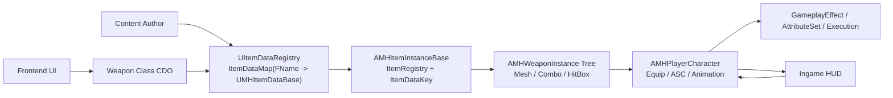
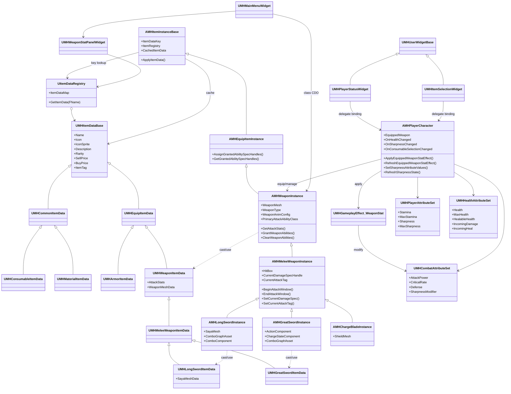
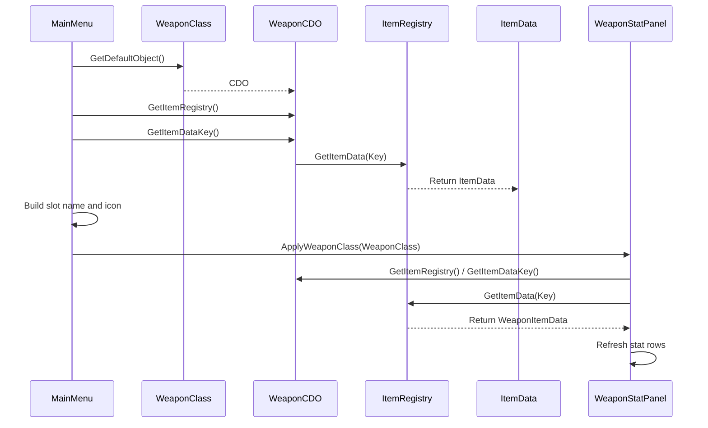
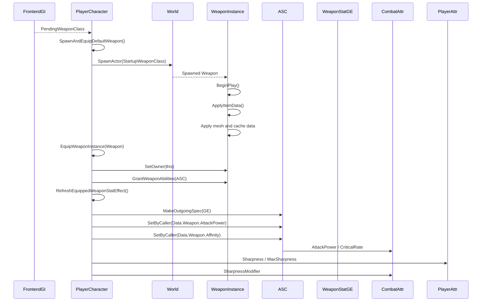
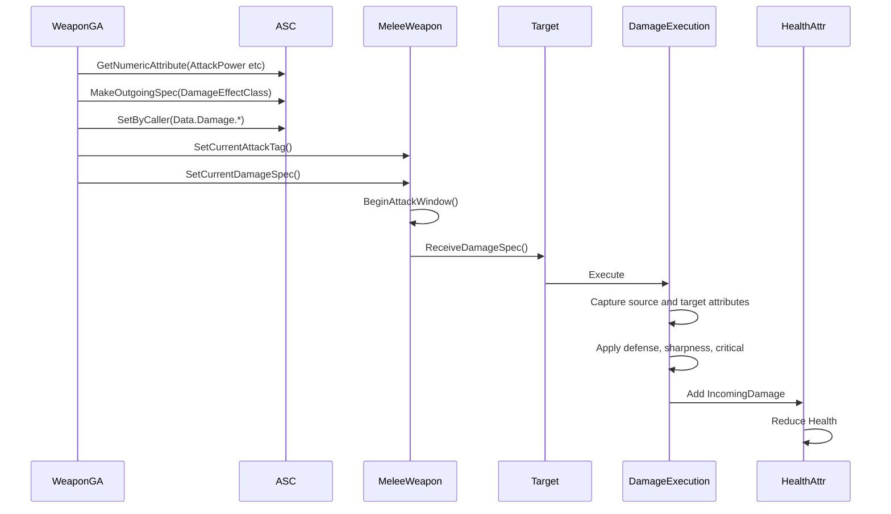
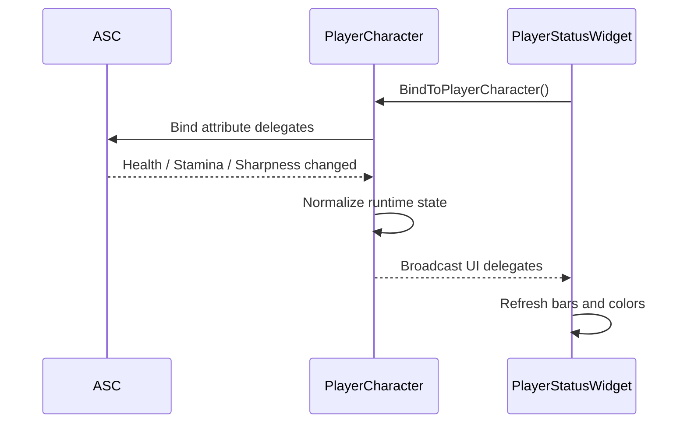
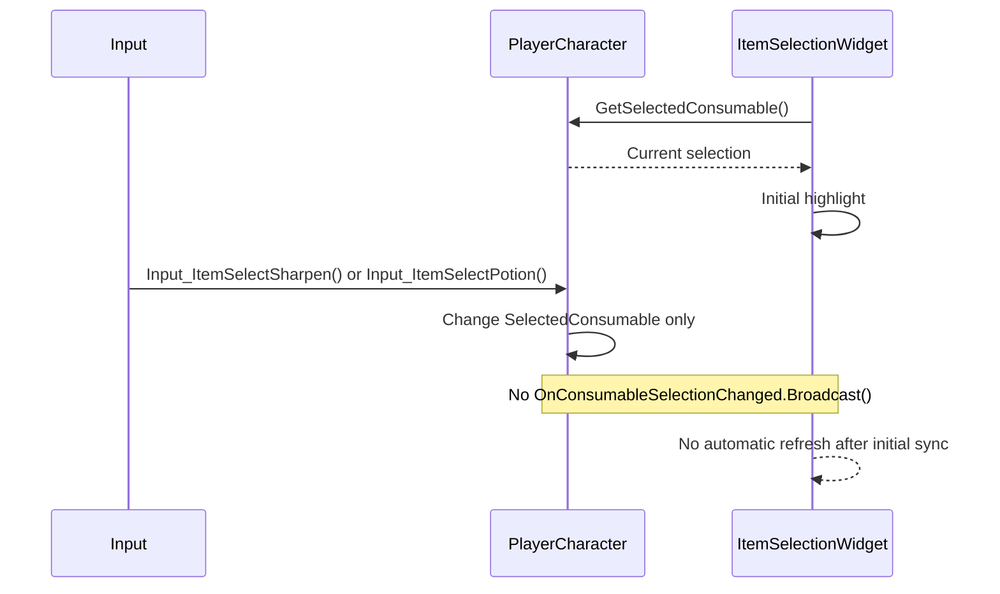

# 아이템 계층구조 및 외부 참조/적용 UML

## 1. 레이어 구조도

- 정적 데이터는 `Registry`에 모이고, 런타임 적용은 `ItemInstance -> Player -> Combat` 순서로 연결된다.
- 프론트 UI만 유일하게 `Weapon Class CDO`를 통해 정적 데이터를 직접 읽는다.

## 2. 클래스 구조도

- 데이터 계층과 인스턴스 계층은 상속 구조가 뚜렷하다.
- 실제 장비 적용과 UI 갱신은 모두 `AMHPlayerCharacter`를 중심으로 모인다.

## 3. 프론트 미리보기 시퀀스

- 프론트는 라이브 액터 없이 `CDO`만으로 프리뷰를 만든다.
- 이 경로는 전투용 장비 적용 경로와 완전히 별개다.

## 4. 실제 장비 및 스탯 적용 시퀀스

- 무기 메시 적용은 무기 인스턴스가 맡고, ASC 반영은 플레이어가 맡는다.
- 아이템 데이터는 장비 시점에 전투용 Attribute로 한 번 변환된다.

## 5. 공격 데미지 적용 시퀀스

- 실제 데미지는 `FMHAttackStats` 직접 계산이 아니라 `ASC 현재값` 기준 계산이다.
- 무기 데이터는 초기 장비 스탯의 원본이고, 실제 전투는 `Execution` 단계에서 마무리된다.

## 6. 인게임 HUD 갱신 시퀀스

- 인게임 HUD는 AttributeSet을 직접 읽기보다 플레이어 델리게이트를 소비한다.
- 예리도 바 색상도 Attribute 값과 무기 데이터 분포를 플레이어가 해석한 결과를 사용한다.

## 7. 소비 아이템 선택 구조의 현재 단절 지점

- 소비 아이템 선택 UI는 의도상 이벤트 기반이지만, 현재 구현은 값만 바꾸고 이벤트를 보내지 않는다.
- 그래서 `UMHItemSelectionWidget`은 초기화 이후 자동 갱신이 끊긴 구조로 해석된다.

## 8. 해석 메모

- 프론트는 `정적 프리뷰 경로`다.
- 게임플레이는 `런타임 장비 경로`다.
- 전투는 `ASC 현재값 기반 계산 경로`다.
- 인게임 HUD는 `플레이어 델리게이트 소비 경로`다.

즉, 같은 아이템이라도 `참조 시점`, `참조 주체`, `적용 대상`이 레이어마다 다르다.
