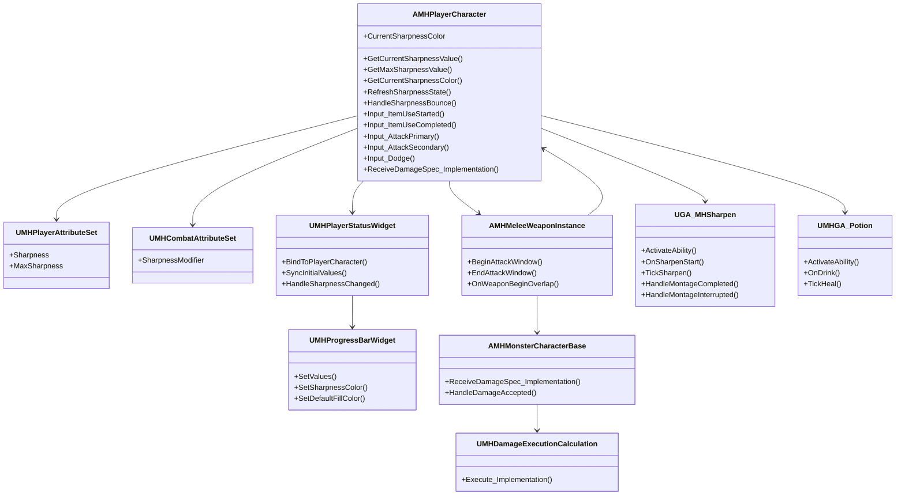
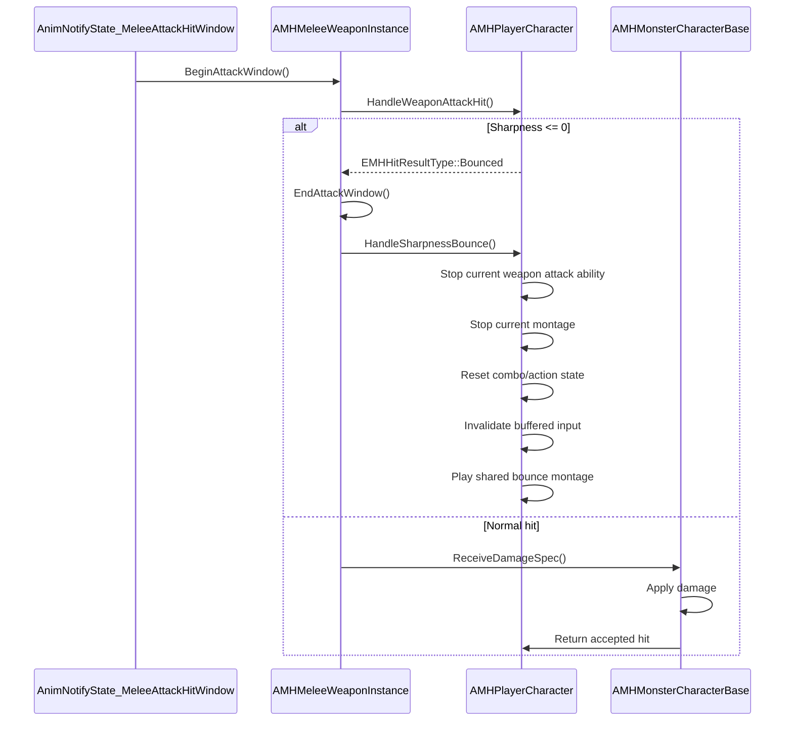
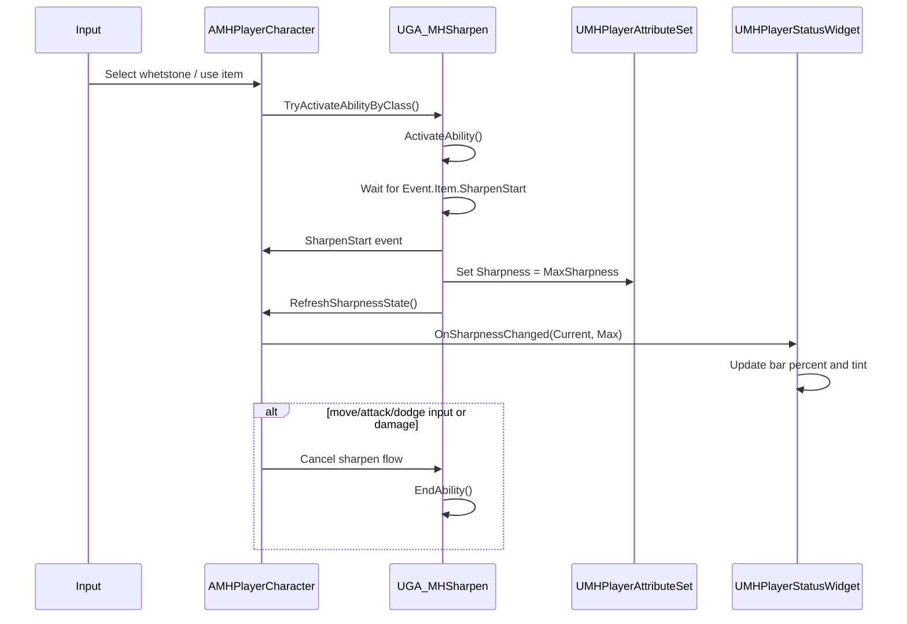
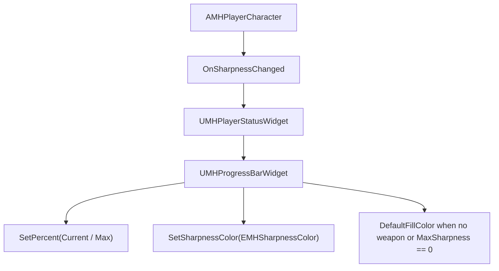

# Sharpness UML

## Class View

## Bounce Sequence

## Sharpen Sequence

## UI Flow

## Notes
- `CurrentSharpnessLength` is intentionally excluded from the active model.
- `GetSharpnessMultiplier()` in `MHCombatStatStructType.h` is the single physical sharpness multiplier source.
- Sharpness color lookup is done on the player, then pushed into the UI.
- `UMHProgressBarWidget` is reused for stamina and sharpness, so the default tint must remain available for non-sharpness bars.
