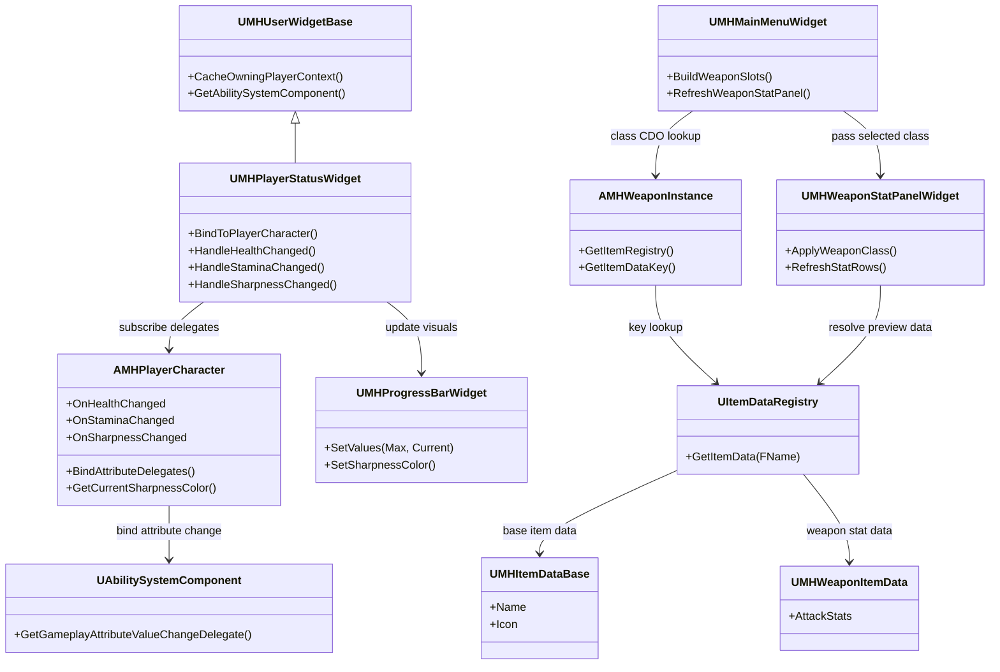
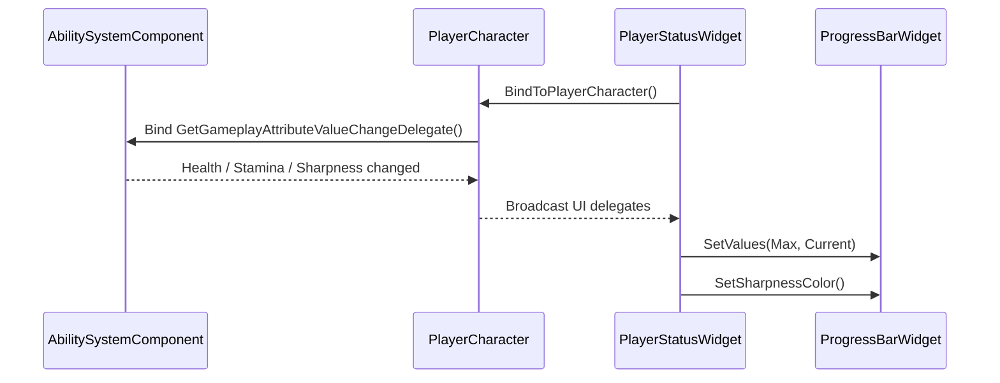
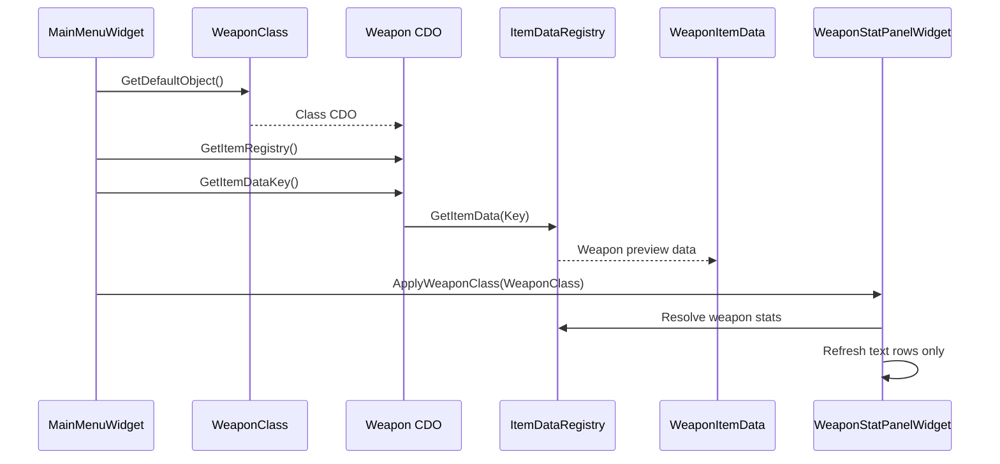
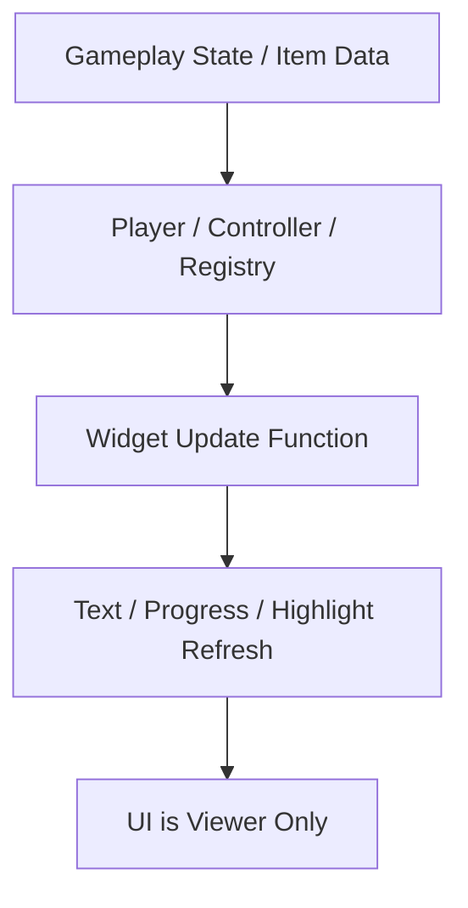

# UI Viewer Role UML

## 1. 클래스 구조

- 인게임 UI는 `PlayerCharacter`가 브로드캐스트한 상태를 소비한다.
- 프론트 UI는 무기 클래스 CDO와 `ItemDataRegistry`를 통해 정적 데이터를 조회한다.
- 두 UI 모두 상태 계산의 주체가 아니라, 외부 상태를 표시하는 소비자다.

## 2. 인게임 HUD 갱신 시퀀스

- UI는 Attribute를 직접 계산하지 않고, 플레이어가 정리한 값을 받는다.
- `UMHProgressBarWidget`은 퍼센트와 색상만 갱신한다.

## 3. 메인 메뉴 프리뷰 시퀀스

- 프론트 메뉴는 런타임 무기 액터를 만들지 않는다.
- UI는 레지스트리에서 얻은 결과를 텍스트와 이미지로 표시만 한다.

## 4. UI 뷰어 원칙 플로우

- UI는 `상태 저장소`가 아니라 `최종 표시 레이어`라는 점을 강조하기 위한 발표용 도식이다.
